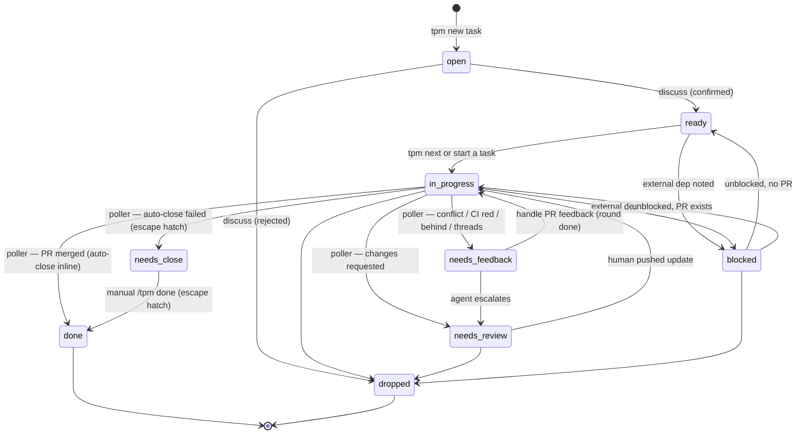

# Agent guide for tpm

If you (an AI coding agent) are working with `tpm` — reading state from a tpm tree, executing a task on behalf of the user, scaffolding new work — start here.

This doc is the canonical, agent-neutral guide for **using tpm**. It's deliberately scope-free of any specific repo's shipping rules: each repo has its own workflow doc (`AGENTS.md` / `CLAUDE.md` / a `workflow:` pointer in `project.md`), and the action procedures below tell you to resolve and follow that workflow when shipping. So this file is safe to symlink or copy into other repos as ambient context — it won't bleed this repo's `npm test`/PR conventions into theirs.

The Claude Code dispatch surface (`/tpm`, `/tpm discuss`, …) lives in `skills/tpm/SKILL.md`; it mirrors the action procedures below. Agents that don't have slash commands (Codex CLI, GitHub Copilot, plain SDK loops) follow these procedures directly when the user asks for the equivalent action in natural language. See `docs/agents/` for per-agent setup.

For shipping rules specific to **this repo** (the tpm CLI itself), see `CONTRIBUTING.md`.

## CLI

Run `tpm --help` to discover every subcommand and flag. The action procedures below name the specific commands they need.

## Schema

- **Project frontmatter**: `name, slug, status, created, repo: {remote, local}, host, tags`. `host` is `github` (default) or `ado` — see the dispatch bullet under Conventions.
- **Task frontmatter**: `title, slug, project, status, type, created, closed, prs, tags` (inherits `repo` from project; can override by adding own `repo:` block). Optional `parent: <parent-slug>` marks the task as a child within a folder-form parent. Investigation deliverables live at `<project>/tasks/<slug>/report.md` (presence of the file is the report — no frontmatter field) — written by `tpm report <slug>`, which auto-folds file-form tasks so the folder exists. Optional `agent: <name>` (e.g. `claude`, `copilot`) picks which CLI `tpm orchestrate` invokes for this task; same field works on project frontmatter for a per-project default, and `agent` in `~/.tpm/config.json` is the global default (fallback: `claude`).
- **Task shapes**:
  - **Folder form** (default for top-level tasks): `tasks/NNN-slug/task.md`, plus optional `NNN-.md` child siblings (each with `parent: NNN-slug` in frontmatter) and any other files (`runs/`, `report.md`, scratch notes, screenshots, design docs). The directory name is the task's slug.
  - **File form** (legacy): `tasks/NNN-slug.md`. A single file, no folder. Pre-folder-form top-level tasks still load this way and auto-fold when they gain a child, run, or report. Child tasks are always flat `.md` files inside their parent's folder.
- A task with any children is a **container**: not actionable, never returned by `tpm next`, can't be discussed/started directly.
- **Statuses**: `open | ready | in-progress | needs-feedback | needs-close | needs-review | blocked | done | dropped`
  - `open` = author's queue (not yet shaped for an agent).
  - `ready` = agent's queue (Plan is well-specified, an agent can pick it up). Promoted via the **shape an open task** action.
  - `in-progress` = work in flight; for `type: pr` tasks this includes the period after the PR is opened, awaiting merge.
  - `needs-feedback` = agent's queue for in-flight PRs — merge conflict, CI red, branch behind main, or open review threads with a fixable suggestion. Routed to the **handle PR feedback** action. Set by the PR-signal poller (`tpm poll`) or by the agent during a feedback round.
  - `needs-close` = transient/escape-hatch state for merged PRs. The PR-signal poller flips a task to `needs-close` and immediately calls `tpm complete --outcome "<derived from PR title + body>"` in the same tick, so under normal operation the task is `done` by the time anyone looks. A task only lingers at `needs-close` when the inline auto-close fails (PR body empty, `Outcome` already filled, lock contention) — surface those with `tpm ls --status needs-close` and run the **close out** action manually.
  - `needs-review` = human's queue — agent escalated (e.g. design pushback on a thread, `CHANGES_REQUESTED`, a merge conflict the agent couldn't resolve cleanly). Surfaced via `tpm inbox`.
  - `blocked` = human's queue, external dep. Surfaced via `tpm inbox`.
  - Parent containers display a roll-up status (all children done → done; any in-progress → in-progress; else parent's declared status). The roll-up is display only — never written to frontmatter.
- **Types**: `pr | investigation | spike | chore`
- **Project body**: `## Goal`, `## Context`, `## Notes`, `## Log`. The project Log is a timeline for events that don't belong to any single task — pivots, milestones, status flips, decisions that span multiple tasks. Use the same `- YYYY-MM-DD HH:MM ZZZ: <event>` format as task Logs. Keep per-task events in the task's own Log (don't double-write).
- **Task body**: `## Context`, `## Plan`, `## Log`, `## Outcome`
- Code work happens in `repo.local`. `tpm context` calls this out; `tpm path <target>` prints it for shell composition (`cd $(tpm path my-task)`).
- For an agent-friendly briefing on a single task, run `tpm context <task>` or `tpm context <project>/<task>`.

## Slug resolution

- A bare slug works when it's globally unambiguous (e.g., `017-hierarchical-tasks` or `hierarchical-tasks`).
- If a bare slug matches multiple tasks (e.g., two children named `discuss` under different parents), the CLI errors and asks you to qualify it.
- Qualified forms: `<project>/<task>`, `<parent>/<child>`, `<project>/<parent>/<child>`. Use whichever disambiguates.

## Lifecycle

Statuses split into two queues. The agent works `ready` and `needs-feedback`; the human works `open`, `needs-review`, and `blocked`.

| Status            | Queue       | Picked up by                      |
|-------------------|-------------|-----------------------------------|
| `open`            | human       | `tpm inbox` / manual triage       |
| `ready`           | agent       | `tpm next` → start a task         |
| `needs-feedback`  | agent       | `tpm next` → handle PR feedback   |
| `needs-close`     | (transient) | poller auto-closes inline; manual `/tpm done <slug>` for stragglers |
| `in-progress`     | passive     | (work happening or waiting on review) |
| `needs-review`    | human       | `tpm inbox` (agent escalated)     |
| `blocked`         | human       | `tpm inbox` (external dep)        |
| `done` / `dropped`| —           | (terminal)                        |

`tpm next` selection priority: `needs-feedback` > stranded `in-progress` > `ready`. The middle bucket is the safety net for agents that exit without flipping out of `in-progress`: the per-task lock is the source of truth for "is someone working on this," and an `in-progress` task with no held lock is reclaimable. `tpm next` admits it as a candidate so the next orchestrator tick re-picks it — in-process admission is the sole reclaim mechanism. The PR-signal poller (`tpm poll`) watches every `in-progress` task plus every `ready` task that still carries a linked PR (a manual `needs-review → ready` revert mustn't strand a task whose PR then merges — see `shouldWatchForPrSignal` in `src/pr_signal.ts`), and flips a watched task into `needs-feedback` (merge conflict, CI red, behind main, open threads) or `needs-review` (CHANGES_REQUESTED), and **auto-closes merged PRs inline**: a MERGED PR flips the task to `needs-close` then immediately calls `tpm complete --outcome "<derived>"` in the same tick (no model invocation, no orchestrator wait). The agent's escalation path during the **handle PR feedback** action also flips `needs-feedback` → `needs-review` when the signal isn't agent-addressable (including a merge conflict the agent couldn't resolve).

## Script-authored tasks

Some tasks aren't human-authored — a user may run their own recurring intake script (cron / launchd) that harvests state on a clock and creates pre-shaped tasks via the CLI. Lifecycle is identical to a human-authored task: the script just skips the discuss step and lands the task at `ready`. When you pick one up, follow the same actions as any other task. The intake commit (e.g. "Review PR #N: <title>") tells you what to do; the body's Context section has the pointers (PR URL, branch, diff command). No recurring intake script ships with tpm itself.

## Actions

When the user asks for one of these — by slash command, natural language, or a CLI invocation — follow the procedure. The Claude Code skill (`skills/tpm/SKILL.md`) maps slash commands to these same actions.

### Situational awareness (no specific task)
1. Run `tpm ls --status in-progress`, then `tpm ls --status ready`, then `tpm ls --status open`.
2. Show a one-screen summary: what's live (`in-progress`), what's queued for an agent (`ready`), and what's awaiting shaping (`open`).
3. Ask which task to work on, or whether to scaffold a new one.

### Start a task
This is the primary action.
1. Run `tpm context <slug>`. Read the briefing in full.
2. If `tpm context` reports the task is a parent container (has children), don't try to work it directly. Print the children (`tpm ls --project 
`) and ask the user which child to pick up.
3. **Dispatch by current status** (so this action does the right thing whatever state the poller left the task in):
   - `needs-feedback` → switch to **handle PR feedback** and stop the start flow.
   - `needs-close` → switch to **close out** and stop the start flow.
   - `open` or `ready` → run `tpm start <slug>` to flip to `in-progress` and stamp a `started` Log entry. (Idempotent: already-`in-progress` is a no-op.)
   - anything else (`in-progress`, `needs-review`, `blocked`, terminal) → leave status alone and proceed.
4. `cd "$(tpm path <slug>)"` — that's where the work happens. If `tpm path` errors because no local path is set, ask the user for the path and offer to populate `repo.local` in the project (or task) file.
   - **Before cutting a feature branch, refresh `main`.** Run `git checkout main && git pull --ff-only`. If the working tree has uncommitted changes or the pull doesn't fast-forward (you'll see `Aborting` / `Not possible to fast-forward`), run `tpm block <slug> "stale checkout — needs human reconcile"` and exit — don't try to rebase, stash-and-pray, or push through. PR #120 hit the canonical failure (branched off stale local main → conflict at merge); the orchestrator-spawned execution prompt repeats this rule so unattended runs can't reach review from a stale checkout either.
5. **Resolve the workflow doc.** This tells you how to validate, how to ship, and when to close.
   - If the briefing has a `Workflow:` line, read that file (path is relative to the repo root).
   - Else look for `AGENTS.md`, then `CLAUDE.md`, in the repo root.
   - Else ask the user before each shipping step (commit, push, PR, close).
6. Read the task body and execute the Plan. If the type is `investigation`, your deliverable is a **report file** (not a PR, not findings written into the task body) — see step 8's investigation branch.
7. As you make meaningful progress, run `tpm log <slug> "<what changed>"` to append a timestamped Log entry. Don't load the task file just to write a Log line.
8. **To ship**, the verb depends on the task type:
   - **`type: pr`**: follow the workflow doc verbatim — validate (run any checks/tests it names), commit, push, open PR. Then `tpm pr <slug> <url>` — that adds the URL to `prs:`, logs the open, and auto-flips `in-progress → needs-review` (the handoff to the human). If the workflow says "close after merge" (the default for `type: pr`), stop after `tpm pr` — the poller closes the task inline when the PR merges; manual **close out** is the escape hatch.
   - **`type: investigation`**: your deliverable is a report file at `<project>/tasks/<slug>/report.md`. Run `tpm report <slug>` — it auto-folds the file-form task into a folder and scaffolds `report.md` from the template. Write the findings into that file (sections: `## Summary`, `## Findings`, `## Recommendation`). When the report is complete, re-run `tpm report <slug>` — the CLI auto-flips `in-progress → needs-review`. Do **not** open a PR; do **not** run `tpm pr`. A reviewer runs `tpm lgtm <slug>` to approve (derives the Outcome and completes the task) or `tpm request-changes <slug> "<comment>"` to push back (appends the comment to `## Reviewer feedback` in the report file and flips back to `needs-feedback`). For a feedback round, address the comment in the same report file, then re-run `tpm report <slug>` to bounce status back to `needs-review`.
   - **`type: chore` / `type: spike`**: workflow doc decides. Defaults: chore tracks like a PR; spike like an investigation.
9. If you hit a blocker you can't resolve: run `tpm block <slug> "<reason>"` to set `status: blocked` and log the reason. Then surface to the user instead of guessing.
10. **Never exit while the task is still `in-progress`.** A task at `in-progress` with no active agent is stranded — without intervention, no one picks it up until a human or sweeper notices. On every exit path, leave the task in a recoverable state:
    - **Work shipped** (PR opened, investigation report attached, etc.): the relevant CLI call (`tpm pr`, `tpm report`, `tpm complete`) has already flipped the status. Nothing more to do.
    - **Can't proceed but the next round might unblock you** (waiting on a dependency, partial investigation that needs another pass, missing info that may arrive): run `tpm revert <slug> "<reason>"` — flips back to `ready` with a Log line so another orchestrator tick can re-pick it. Investigations that are incomplete after one round especially need this: append what you found to the report file (or stash a draft in `notes/` if the report doesn't exist yet), then revert. The harness has one safety net — an in-process auto-revert at clean exit (`src/orchestrate.ts:shouldAutoRevert`) — plus `tpm next` admits a stranded `in-progress` (status set, lock gone) as a recoverable candidate on the next tick. Rely on those only as last resorts; an explicit `tpm revert` with a reason is much better signal for whoever (or whatever) re-picks the task.
    - **Genuinely blocked** (need a human decision, missing credentials, design pushback): see step 9.

    If you find yourself about to exit while the task is still `in-progress`, stop and pick one of the above first. `tpm revert` is the safe default if you can't make a confident classification.

**After `tpm pr` on a `type: pr` task, your turn is over.** Don't poll CI, don't re-read the task body, don't run extra checks. Exit. The PR-signal poller (`tpm poll`) closes the task inline when the PR merges and re-flags it to `needs-feedback` if CI fails or a reviewer requests changes — that's the poller's job, not yours. Manual close-out is only the escape hatch for stragglers. Burning your time bound waiting for CI is the canonical 050/053 failure mode.

**Default for unanticipated decisions.** When a fork comes up during implementation that the task body didn't pre-answer, pick the smaller / more local change, ship it, and note the deferred consideration in the Outcome (or file a follow-up task). Don't stop to ask — the user reviews the PR; redirection happens there. The canonical anti-pattern: task 046 (2026-05-10) — the agent finished correct in-scope work, then halted to ask about a related-but-out-of-scope extension; the work sat uncommitted until the user picked it up manually.

Exceptions — halt and surface instead of shipping:
- **Irreversible / destructive actions**: force-push to `main`, `rm -rf` outside the worktree, dropping migrations, deleting non-recoverable state, mass-rewriting user files outside the task scope.
- **Genuinely ambiguous task intent**: if the task body is so unclear you can't tell what to ship, that's a `tpm block` situation (step 9), not "ship smaller and hope."

"I'd like a second opinion before extending scope" is not a blocker. "I can't tell from the task what the scope is" is.

### Shape an open task (pre-execution discussion)
Shape a task's Plan before any execution. Pure conversation that lands in the task body — never edits code, never `cd`s into the repo, never flips status to `in-progress`.
1. Run `tpm context <slug>`. Read the briefing in full.
2. If the task is a parent container (has children), shaping is not applicable — list the children and ask which one to shape instead.
3. **Do not** `cd`. **Do not** edit code in `repo.local`. **Do not** set `status: in-progress`.
4. Read `## Context` and `## Plan`. If thin or missing key details, ask clarifying questions: scope, constraints, what "done" looks like, dependencies on other tasks, open decisions.
5. As alignment forms, write back to the task body via direct file edit — `## Context` for facts and background, `## Plan` for the agreed approach, optionally a `## Done =` section. Body authoring is the one place agents still edit the task file directly. For the Log line, use `tpm log <slug> "<what was discussed/decided>"` rather than editing manually.
6. (Optional) Autonomous-eligible is the default: `tpm ready` (step 7) sets `allow_orchestrator: true`, so the common "shaped and safe to run unattended" case needs no extra step. For the rare supervised-only case (destructive migration, risky refactor where you want to be at the keyboard), run `tpm disallow <slug>` after promoting — it stays `ready` and pickable manually but the autonomous scheduler skips it.
7. End condition: the user signals alignment ("okay let's go", "that looks right", "yes start it"). Run `tpm ready <slug>` — that flips status to `ready`, sets `allow_orchestrator: true`, and logs `promoted to ready` in one call. Then stop and tell the user the task is ready to execute.
8. If discussion concludes the task isn't worth doing: edit `## Outcome` with the reason (file edit, since `tpm complete --outcome` would also flip status to `done` rather than `dropped`), then run `tpm status <slug> dropped`. Don't promote.

**Open questions should be answered, not just enumerated.** A `## Open questions` section that lists questions without defaults turns each one into a halt point for the implementing agent (the "ship the smaller change" rule in **Start a task** only covers decisions the task body didn't mention at all — listed-but-unanswered questions are louder than that). Answer each question with a v0 default, even a tentative one. If a question genuinely can't be decided up front, mark it explicitly: `Decide during implementation; default to <X>.` The implementing agent then has an instruction rather than an open prompt.

This is the canonical way to move a task from `open` to `ready`. A human can also flip the status manually, but the shaping action encodes the discipline (Context/Plan populated, Log timestamped, explicit confirmation).

### Pick the next ready task and run it
Auto-select mode. Resolves the next eligible leaf task (parents are skipped) and dispatches the right action based on status.
1. Run `tpm next` (optionally with `--project <slug>`). It prints a qualified slug on success or exits non-zero if nothing is eligible. Selection priority: `needs-feedback` > `ready`. (`needs-close` isn't in the priority — the poller auto-closes merged PRs inline, so the agent queue doesn't dispatch close-outs. Stragglers go through the manual **close out** action via `/tpm done <slug>`.)
2. If non-zero, surface the message and stop. Don't fall back to `open` tasks — the human needs to promote one via the shaping action first.
3. On success, look up the task's status (`tpm context <slug>` shows it). Dispatch:
   - `ready` → **start a task** action
   - `needs-feedback` → **handle PR feedback** action
4. After the action returns, the next `tpm next` invocation may pick a different task — don't loop here; the wrapper (cron, slash command) controls cadence.

`tpm next --autonomous` is for scheduled/unattended runs only — it filters to tasks with `allow_orchestrator: true`. Manual invocations don't pass `--autonomous`.

### Handle PR feedback
For the in-flight phase of a `type: pr` task — the PR is open, the task is `in-progress` or `needs-feedback`, and a CI failure / stale branch / review thread needs attention. Re-entrant: invoke once per round of feedback. Don't use this to start a task or to close one out; it sits between those.

1. Run `tpm context <slug>`. Read the briefing in full. **Refuse if `prs:` is empty** — there's no PR to give feedback on; the user probably wants **start a task** or **close out** instead.
2. If the task is `done`, `dropped`, or `blocked`, refuse — feedback only applies to in-flight work.
3. **Gather signal** for each linked PR using the host CLI per `Host:` in the briefing (`gh` for `github`, `az repos pr` for `ado`):
   - GitHub: `gh pr view <url> --json state,isDraft,reviewDecision,mergeStateStatus,statusCheckRollup,latestReviews`. Unresolved review threads are not a `gh pr view --json` field — fetch them with `gh api graphql` (query `repository.pullRequest.reviewThreads`) or just read the PR page if you need the resolution state.
   - ADO: `az repos pr show --id <id> --query '...' -o json`
   - Surface to the user (and yourself): review state (`APPROVED` / `CHANGES_REQUESTED` / `COMMENTED` / `REVIEW_REQUIRED`), open review threads with line + body, CI status, mergeability (`CLEAN` / `BEHIND` / `DIRTY` / `BLOCKED` / `UNSTABLE`).
4. **Pick what to address** in priority order — rebase resolves a class of issues before you spend cycles on threads, CI tells you whether the current code even works:
   1. `BEHIND` (stale branch) or `DIRTY` (merge conflict)
   2. CI failures
   3. Open review threads
   If nothing is actionable (CI green, mergeable, no open threads, `APPROVED` or `REVIEW_REQUIRED` with nothing pending), tell the user there's nothing to address and stop. Status stays where it is.
5. `cd "$(tpm path <slug>)"` and check out the PR's branch:
   - GitHub: `gh pr checkout <url>`
   - ADO: fetch and check out the source branch (`git fetch origin && git checkout <branch>`)
6. **Apply the fix** by category:
   - **Stale (`BEHIND`)**: `git fetch origin main && git rebase origin/main`. Clean rebase → continue. Conflicts → drop into the conflict flow below.
   - **Merge conflict (`DIRTY`)**: `git fetch origin main && git rebase origin/main`. For each conflict:
     - **Skip on sight, escalate**: binary file conflicts (`git status` reports the path with no `<<<<<<<` markers to reason about). `git rebase --abort` and go to step 8.
     - **Resolve where intent is clear**: read the conflict markers and apply the resolution that preserves both sides' intent. Common mechanical patterns: both sides added imports → take both; adjacent edits to the same line → merge; one side renamed/moved a symbol, the other edited the original → apply the edit at the new location.
     - **Verify with tests (the arbiter)**: after resolving, run the workflow doc's test command. If tests pass, `git add` the resolved files and `git rebase --continue`. If tests fail, the resolution is wrong (or the conflict is semantically ambiguous) — `git rebase --abort` and escalate (step 8). Don't commit a resolution you can't verify; the Log entry tells the human which files to look at.
   - **CI failures**: pull the failed log (`gh run view <run-id> --log-failed` or the ADO equivalent). Fix the failing test/build. Commit with a clear message ("Fix: <what failed> — <one-line cause>").
   - **Review threads**: read each unresolved thread. For threads with a concrete code suggestion, apply the fix and commit. When the fix matches the suggestion exactly (e.g., reviewer pasted code, you applied it verbatim), you may resolve the thread (`gh api repos/<owner>/<repo>/pulls/<n>/threads/<id>/resolve` or the ADO equivalent). For ambiguous, debatable, or design-level threads, **don't apply a guess** — escalate.
7. **Push** the fix commits: `git push`. After a rebase, use `git push --force-with-lease` (never plain `--force` — it can clobber a commit the reviewer pushed concurrently).
8. **Escalate to `needs-review`** when the signal isn't agent-addressable:
   - Merge conflict the agent can't resolve cleanly (tests fail after resolution, binary conflict, or semantically ambiguous)
   - Review thread that's design pushback, ambiguous, or debatable
   - `CHANGES_REQUESTED` with comments you can't translate to a concrete fix
   To escalate: run `tpm status <slug> needs-review`, then `tpm log <slug> "escalated — <one-line reason, link the thread or run>"`. For a rebase escalation, the one-liner should name the conflicting files so the human knows where to look (e.g. `rebase escalation — conflicts in src/foo.ts, src/bar.ts: tests fail after auto-resolve`). Surface to the user and stop. Don't try to argue with a reviewer in chat or guess at intent.
9. **Log + status** after a successful round:
   - `tpm log <slug> "addressed feedback — <one-line summary of what shipped this round>"`
   - If the task was `needs-feedback`, run `tpm status <slug> in-progress` (the round is done; PR returns to passive-wait until the next signal lands or it merges). If already `in-progress`, this is a no-op.
10. The PR-signal poller (`tpm poll`) will re-flag the task to `needs-feedback` if the next CI run fails or new threads land. Each round = one more invocation of this action.

Don't:
- **Auto-merge** the PR. Always a deliberate human decision.
- **Reply conversationally** to a thread without a code change. If a thread needs a written explanation rather than a fix, escalate to `needs-review`.
- **Long-poll for CI** to finish. The mode is one-shot per round; the poller (or user re-invocation) handles re-entry.
- **Force-push without `--force-with-lease`**. The lease check is the only thing standing between you and clobbering a reviewer's commit.

### Close out
1. Read the task file.
2. **Verify PR merge status** if `prs:` is non-empty. For each PR URL, run `gh pr view <url> --json state --jq '.state'`.
   - At least one `MERGED` → proceed.
   - All `OPEN` or `CLOSED` (none merged) → ask once: "PR not merged; close anyway?" Respect the answer. This is the only legitimate ask in close-out.
   - `gh` not installed or not auth'd → fall back to the same ask. Don't fail hard.
   - `prs:` empty (direct-push task) → skip merge detection.
   - **Shortcut:** if the task's current status is `needs-close`, the poller has already verified a linked PR merged — you can skip the `gh pr view ... --jq '.state'` round trip and proceed directly.
3. Fill `## Outcome` with what shipped, what changed, what was learned. Reference PRs. (Free-form prose: edit the file directly. The CLI will refuse to overwrite an Outcome that already has content, so author it before the next step.)
   - **Autonomous fill (status `needs-close`):** stragglers reach this action only when the poller's inline auto-close failed (PR body empty, `Outcome` already filled, lock contention). You may still fill `## Outcome` from PR signal (title + body + recent commits via `gh pr view <url> --json title,body,commits`) without prompting the user — the merge already shipped; a faithful summary of the PR description is an acceptable Outcome. Reference each merged PR.
4. Run `tpm complete <slug>`. This flips status to `done`, stamps `closed`, appends a `closed` Log line, and **archives by type**: `pr`/`chore` move under `tasks/archive/`; `investigation`/`spike` stay at the canonical path so `tpm ls --status done` and `tpm context <slug>` continue to find them. Override the default with `--archive` or `--no-archive` when needed.
5. **Cleanup local branch** (when at least one linked PR was merged). For each merged PR:
   - `BRANCH=$(gh pr view <url> --json headRefName --jq '.headRefName')`. Skip if `BRANCH` equals the project's default branch (typically `main`).
   - `cd "$(tpm path <slug>)"`. If the local branch doesn't exist (`git rev-parse --verify "$BRANCH"` fails), skip — already cleaned up.
   - `git checkout main && git pull --ff-only`.
   - `git branch -d "$BRANCH"`. **Use `-d`, not `-D`** — if git refuses (e.g., you kept working on the branch after merge), surface the message and let the user decide. Don't force-delete.
   - Check the remote: `git ls-remote --heads origin "$BRANCH"`. If it still exists (GitHub's auto-delete-head-branches isn't on for this repo), print the one-liner `git push origin --delete <BRANCH>` for the user to copy/paste. Don't run it silently.
6. Print a one-line confirmation: new status, archive path (or "kept at <path>" for investigations/spikes), and the remote-delete hint if applicable.

### Scaffold a project or task
- New project: `tpm new project <slug> [--name "..."] [--repo <url>] [--path <local-dir>]`. Ask about `--repo` and `--path` if not provided.
- New task: `tpm new task <project> <slug> [--title "..."]`. Use `--parent <parent-slug>` to create a child task; the parent is folded automatically if it isn't already.
- After scaffolding, populate Context/Plan from the user's request or ask for them.

### Fold a task to folder-form
Use when a task needs supporting files (subtasks, scratch notes, screenshots) alongside it. `tpm fold <slug>` rewrites `tasks/NNN-slug.md` to `tasks/NNN-slug/task.md`. Idempotent. Children can then be added with `tpm new task <project> <child> --parent <slug>`.

### Reparent a task
Use when a task ends up in the wrong place — needs to become a child of an existing parent, move between parents, or be promoted back to top-level.

- `tpm reparent <task> <new-parent>` moves a task under a new parent. Folds the new parent automatically if it's still file-form. Renumbers the moved file within the destination container.
- `tpm reparent <task> --top` promotes a child back to top-level (drops `parent:` from frontmatter).

Refuses to move a task that has children (would create grandchildren) or any move that would land the task under a child task. A folder-form task (now the default) moves fine when `task.md` is its only file; if it holds supporting files (`runs/`, `report.md`, children) the move is refused to avoid orphaning them — flatten manually first. Also refuses no-op moves (already a child of the named parent / already top-level). Cross-project moves aren't supported — `<new-parent>` resolves within the source task's project.

## Conventions

- **Prefer CLI verbs over manual file edits for state changes.** Use `tpm start | ready | complete | block | reopen | revert | pull | status | set-type | allow | disallow | log | pr | report | lgtm | request-changes | archive | fold | reparent | new` for frontmatter and Log mutations. Manual file edits are only for body-text authoring (`## Context`, `## Plan`, `## Outcome`).
- When you do edit a task file directly, only touch the four canonical body sections. Preserve key order in frontmatter.
- Don't reformat unrelated frontmatter or rename slugs.
- Don't delete the `## Outcome` section even if empty — it's a closing prompt.
- Don't rewrite project goals without explicit approval.
- Timestamps: the CLI verbs stamp `tpm now` automatically. If you ever need to write one yourself, use `tpm now` (format `YYYY-MM-DD HH:MM <ZZZ>` in the configured TZ — defaults to Pacific). Don't guess or hand-format.
- Don't manually create project/task files where `tpm new` would do it.
- If `tpm` errors with "No tpm tree configured", offer to run `tpm init` (default `~/tpm`).
- Keep edits to the user's actual code repos separate from edits to task files — task files are tracker state, not code.
- Surface CLI errors directly; don't paper over them.
- **PR-related commands dispatch on `Host:` in the briefing.** `github` → `gh` (e.g. `gh pr view`, `gh pr checkout`); `ado` → `az repos pr` (e.g. `az repos pr show`, `az repos pr checkout`). The procedures below show `gh` examples for brevity; substitute the ADO equivalent when the project's host is `ado`. The PR-signal poller has its own per-host adapter layer (`src/hosts/<name>.ts`, dispatched via the `HOSTS` registry in `src/pr_signal.ts`) — adding a new host is one adapter file plus an entry in that array. Agents acting on a PR during `/tpm feedback` still map their commands inline from the `Host:` field; the adapter layer is for the unattended poller, not the agent loop.
