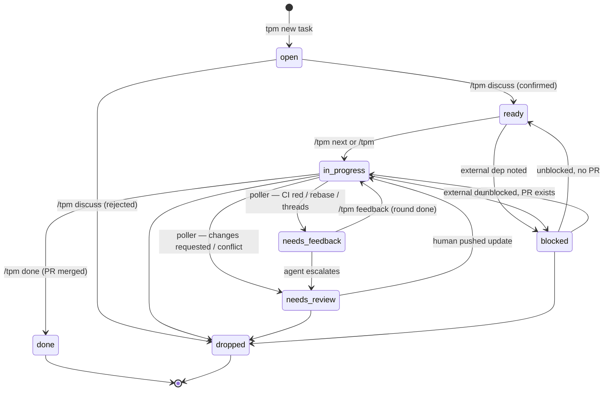

# tpm

[](https://github.com/htalat/tpm/actions/workflows/test.yml)

Markdown-based task & project manager. CLI-driven, agent-friendly. Zero deps — runs on Node 22.18+ via native TypeScript.

## Layout

This repo (the CLI install):
```
bin/tpm                            entry (bash shim → src/cli.ts)
src/                               TypeScript implementation
.tpm/templates/                    distributed default templates
AGENTS.md                          agent-neutral guide for using tpm (safe to drop into other repos)
CONTRIBUTING.md                    shipping rules for the tpm CLI repo itself
skills/<name>/SKILL.md             user-scoped Claude Code skills (symlinked into ~/.claude/skills/)
.claude/skills/<name>/SKILL.md     repo-scoped Claude Code skills (auto-loaded only inside this repo)
docs/agents/                       per-agent setup notes (Claude Code, Codex, Copilot)
```

A tpm tree (data — lives wherever `tpm init` was run, e.g. `~/Documents/projects/`):
```
<root>/.tpm/templates/                          per-tree templates (copied from defaults)
<root>/.tpm/locks/<project>--<slug>.lock        per-task orchestrator locks (gitignore if syncing)
<root>/reports/index.html                       generated rollup
<root>/<slug>/project.md                        goals, context, notes, project log
<root>/<slug>/tasks/NNN-*.md                    file-form task (one file)
<root>/<slug>/tasks/NNN-*/task.md               folder-form task (a parent)
<root>/<slug>/tasks/NNN-*/NNN-*.md              subtasks (`parent:` in frontmatter)
<root>/<slug>/tasks/NNN-*/...                   any other supporting files
<root>/<slug>/tasks/archive/NNN-*.md            archived file-form task
<root>/<slug>/tasks/archive/NNN-*/              archived folder-form parent (whole folder moved)
<root>/<slug>/tasks/archive/NNN-*/NNN-*.md      archived child of a still-live parent
<root>/<slug>/notes/                            free-form scratch
```

Project directories sit as siblings to `.tpm/` and `reports/` — no inner `projects/` nesting.

## Setup on a new device

Bootstraps the CLI, the data tree, and (optionally) the Claude Code skill from scratch. Steps assume zsh/bash on macOS or Linux. Adjust paths if `~/.local/bin` isn't already in your `$PATH`.

```sh
# 0. Prereq: Node 22.18+ (for native TypeScript execution). Verify:
node --version

# 1. Place the tpm repo somewhere stable.
git clone <your-tpm-remote> ~/Developer/tpm   # or copy/sync the directory
cd ~/Developer/tpm

# 2. Put the CLI on $PATH.
mkdir -p ~/.local/bin
ln -sf "$PWD/bin/tpm" ~/.local/bin/tpm
tpm --help                                    # sanity check

# 3. Bootstrap a data tree and write the user config.
tpm init ~/Documents/projects                 # writes ~/.tpm/config.json -> ~/Documents/projects
# or: tpm init                                # default ~/tpm
# or: tpm init ~/Dropbox/projects             # put data wherever you want it synced
tpm root                                      # confirms the tree root

# 4. (Optional) Install the user-scoped Claude Code skills.
# Symlink every dir under skills/ into ~/.claude/skills/. Repo-scoped skills
# under .claude/skills/ are auto-loaded by Claude Code inside this repo and
# don't need symlinking — see "Skill scoping" below.
mkdir -p ~/.claude/skills
for d in skills/*/; do ln -sfn "$PWD/$d" "$HOME/.claude/skills/$(basename "$d")"; done
# Restart any running Claude Code session, then `/tpm` becomes available.

# 5. (Optional) Skip permission prompts for the tpm CLI.
# Add "Bash(tpm:*)" to permissions.allow in ~/.claude/settings.json.
# Easiest way is to ask Claude Code: "add Bash(tpm:*) to my user settings."
```

Verify end-to-end:

```sh
tpm new project sandbox --name "Sandbox" --repo https://github.com/you/sandbox --path ~/code/sandbox
tpm new task sandbox first-thing --title "First thing"
tpm ls
tpm context sandbox/first-thing | head -20
tpm report && open reports/index.html
```

### Skill scoping

Claude Code skills in this repo come in two flavors. The directory decides which:

- `skills/<name>/SKILL.md` — **user-scoped**. Useful from any repo (e.g. `/tpm` for tracking work). Symlinked into `~/.claude/skills/` once during setup; the loop above handles future additions automatically.
- `.claude/skills/<name>/SKILL.md` — **repo-scoped**. Only useful when working inside this repo (e.g. `/release` for cutting tpm releases). Auto-loaded by Claude Code when cwd is under the repo. No symlink, no setup step.

If a skill could go either way, force a choice. Useful outside the repo → user-scope. Otherwise → repo-scope. Don't add a third category.

### Syncing data across devices

The data tree (`~/tpm` or wherever) is just markdown. Easiest options:

- **Cloud folder**: put it in iCloud Drive, Dropbox, or similar; `tpm init <path>` on each device.
- **Git**: `git init` inside the tree, push to a private repo; clone on each device, then `tpm init <path>`.

The CLI install (this repo) and the data tree are independent — you can replace either without touching the other. `~/.tpm/config.json` is the only per-device pointer.

### Re-running setup (idempotency)

- `tpm init <path>` is safe to re-run — it only creates missing files and updates the config pointer.
- `ln -sf` overwrites broken symlinks but doesn't touch the target.
- The skill symlink picks up edits to `skills/tpm/SKILL.md` immediately; no restart needed for content changes (only for first install).

## Install (TL;DR)

If you already have the repo and just want the CLI:

```sh
ln -s "$PWD/bin/tpm" ~/.local/bin/tpm
tpm init
```

## Setting up the harness

So far you have a tracker (`tpm new task`, `tpm ls`, `tpm context`). The **harness** is the optional automation around it: the two-queue lifecycle, the autonomous loop that drains the agent queue, the recurring scripts that feed it, the live dashboard you keep open while doing other things. tpm works as a plain CLI without any of it — turn on whatever you want.

### The two queues

tpm splits work across two inboxes:

| Status            | Queue       | Picked up by                      |
|-------------------|-------------|-----------------------------------|
| `open`            | human       | `tpm inbox` / manual triage       |
| `ready`           | agent       | `tpm next` → `/tpm <slug>`        |
| `needs-feedback`  | agent       | `tpm next` → `/tpm feedback <slug>` |
| `in-progress`     | passive     | (work happening or waiting on review) |
| `needs-review`    | human       | `tpm inbox` (agent escalated)     |
| `blocked`         | human       | `tpm inbox` (external dep)        |
| `done` / `dropped`| —           | (terminal)                        |

`tpm next` returns `needs-feedback` ahead of `ready` (in-flight signal is time-sensitive). `tpm inbox` is the human equivalent: lists `needs-review`, `blocked`, and `open` cross-project, most actionable first.

Promotion `open` → `ready` is a deliberate human act. The canonical way is the `/tpm discuss <slug>` Claude Code skill mode, which shapes the task body via conversation and only flips status on explicit confirmation. Manual frontmatter edits also work.



The poller that flips `in-progress` → `needs-feedback` / `needs-review` ships at `scripts/recurring/check-pr-signal.sh` — see [Recurring scripts](#recurring-scripts) below.

### Drain the agent queue: three flavors

`tpm next` picks the next eligible task. Wrap it in one of three loops depending on how hands-off you want to be.

**1. Manual** — when you're around. From any Claude Code session, type `/tpm next`; the skill picks the slug and dispatches. No setup.

**2. Background tmux loop** — runs while your machine is on. Polls the queue; only fires against tasks you've explicitly opted in:

```sh
tmux new -d -s tpm-loop 'while sleep 60; do task=$(tpm next --autonomous) || continue; claude -p "/tpm $task"; done'
tmux attach -t tpm-loop          # peek
tmux kill-session -t tpm-loop    # stop
```

**3. Cron** — the most hands-off:

```sh
which tpm                        # e.g. /opt/homebrew/bin/tpm
which claude                     # e.g. /opt/homebrew/bin/claude
crontab -e
```

```cron
# Every 4 hours, atomic per-task claim + drift-check, dispatched through tpm orchestrate
0 */4 * * * TPM_AGENT_ID=nightly-runner task=$(/opt/homebrew/bin/tpm next --autonomous --claim "$TPM_AGENT_ID") && /opt/homebrew/bin/tpm drift-check "$task" && /opt/homebrew/bin/tpm orchestrate --task "$task" --claude /opt/homebrew/bin/claude >> ~/.tpm/orchestrator-nightly-runner.log 2>&1
```

Substitute the absolute paths from `which`. cron has a minimal `PATH`, so absolute paths are required. The machine must be awake and logged in for cron to fire.

`TPM_AGENT_ID` names the agent for `tpm lock list`, stale-lock recovery, and notification messages. Pick a stable string per cron entry (`nightly-runner`, `pr-feedback-runner`, etc.) so the lock listing is human-readable and notifications can tell you which runner pinged. For ad-hoc shell use, `${HOSTNAME}-$$` is a fine default.

**Agent affinity.** When you have a "big-repo agent" with that repo's deps and credentials already set up, you don't want a different agent grabbing tasks for it. Declare per-agent preferences in `~/.tpm/agents.json`:

```json
{
  "agents": {
    "nightly-runner":      { "prefer_repos": ["tpm"],            "comment": "fires hourly; tpm-only" },
    "work-bigrepo-runner": { "prefer_repos": ["acme-platform"],  "comment": "has the right env" },
    "laptop-htalat":       { "prefer_repos": []                                                      }
  }
}
```

`tpm next --claim "$TPM_AGENT_ID"` filters candidates to the agent's `prefer_repos` (matched against the project slug). Agents with empty `prefer_repos` (or no entry) see all tasks. The escape hatch is `tpm next --claim ... --any-repo` — skips the filter for "I really want any task." File is per-host; never sync it via git.

CLI helpers:

```sh
tpm agents list                                    # who's preferred where
tpm agents add nightly-runner --repo tpm           # append a preferred repo
tpm agents remove laptop-htalat                    # drop an entry
```

Backward compat: missing or empty `~/.tpm/agents.json` means "no affinity configured" — the harness behaves exactly as if the registry didn't exist.

**Per-agent log files.** Redirect each cron entry's stdout/stderr to its own file (`~/.tpm/orchestrator-<agent-id>.log`) so multiple agents don't interleave their logs. Same convention for tmux loops:

```sh
tmux new -d -s tpm-loop-laptop \
  'export TPM_AGENT_ID=tmux-laptop; while sleep 60; do task=$(tpm next --autonomous --claim "$TPM_AGENT_ID") || continue; tpm orchestrate --task "$task" --claude $(which claude); done >> ~/.tpm/orchestrator-tmux-laptop.log 2>&1'
```

`tpm lock list` is the live view of who's running what:

```
$ tpm lock list
PROJECT/SLUG                          AGENT-ID            ACQUIRED  HEARTBEAT
acme/refactor-auth                    nightly-runner      12m       12s
web/migrate-orm                       laptop-htalat-7421  3m        1s
```

Stale heartbeats (much larger than acquired-age) are visually obvious. `tpm lock release-stale` clears them; orchestrate runs that automatically on startup.

The `--autonomous` gate is the safety boundary between "an agent can run this when I ask" and "an agent can run this while I'm asleep." `tpm next --autonomous --claim` skips ready tasks unless they have `allow_orchestrator: true`; opt in per task as you trust each. The `--claim` flag turns the pick into an atomic claim (`O_CREAT | O_EXCL` on `<root>/.tpm/locks/<project>--<slug>.lock`) so multiple cron entries running in parallel don't double-dispatch on the same task.

`tpm orchestrate` (the dispatcher) layers four safety rails on top of a bare `claude -p` invocation:

- **Per-task lock** — atomic claim via `O_CREAT|O_EXCL`. The orchestrator heartbeats every 60s during the run so a sibling agent's stale-lock sweep doesn't reclaim it. Released on exit (success, timeout, or error). `tpm lock list` shows what's currently in flight; `tpm lock release-stale [--ttl <minutes>]` clears anything past TTL (default: time-bound + 5min). The legacy single global lock (`tpm lock acquire` with no task argument) still works for one release with a deprecation warning, then will be removed.
- **Same-repo strategy** — when two agents claim different tasks in the same `repo.local`, they collide on the working tree. Each project picks one of two strategies via the `same_repo_strategy` frontmatter field:
  - **`serialize`** (default) — adds a repo-level lock alongside each per-task lock. Only one task runs against a given repo at a time; tasks in *other* repos still run in parallel. `tpm next --claim` and `tpm orchestrate` both honor it; if the repo is busy, they fall through to the next eligible candidate. Safe for any repo size; caps same-repo throughput at 1 (which is usually correct — most teams don't want two LLMs editing the same checkout simultaneously).
  - **`worktree`** — *declared but not implemented in v0.* Each task would get its own `git worktree add` checkout, allowing same-repo parallelism at the cost of N working trees. The frontmatter field accepts the value (so projects can pre-declare intent), but `tpm orchestrate` and `tpm next --claim` currently refuse to dispatch worktree-strategy tasks. Implementation lands in a follow-up; until then, leave the field unset (or set to `serialize`) to use the harness.
- **Drift check** — `tpm drift-check <task>` refuses to dispatch if the project's `repo.local` is on a non-default branch or has uncommitted changes. Manual `/tpm <slug>` runs skip this; humans can knowingly work on a dirty tree.
- **Time bound + revert** — the dispatched run is hard-killed at the `time_bound_minutes` boundary (cascade: task > project > global config > built-in default 30m). On timeout, `tpm revert <task>` flips the task back to `ready` so the next cron tick can retry. Exit codes mirror `timeout(1)` (`124` on timeout).
- **Notifications** — `osascript` pings at start/finish/fail, gated by a `notifications` cascade (task > project > global config > default `{ start: false, finish: true, fail: true }`). v0 channel is mac only; non-darwin runs log to stderr and skip. `tpm notify <event> <task>` is the same hook as a CLI verb.

### Recurring scripts

Tasks don't have to be human-authored. A recurring script harvests state on a clock (open PRs, stale deps, alert spikes) and creates pre-shaped `ready` tasks via the CLI. No LLM, no judgment — mechanical intake.

Two ship in this repo:

- **`scripts/recurring/template.sh`** — copy this, fill in the four TODO blocks (source command, slug derivation, optional Context/Plan population, summary line). Idempotent on re-run via the `tpm context "$PROJECT/$slug" >/dev/null 2>&1` existence check.
- **`scripts/recurring/check-pr-signal.sh`** — the PR-signal poller. Walks every `in-progress` task with non-empty `prs:`, queries `gh` (v0 supports `host: github` only; ado projects skipped with a warning), and flips status to `needs-feedback` (CI red / branch behind / open threads) or `needs-review` (`CHANGES_REQUESTED` / merge conflict).

Customize the template for your own intake (review my open PRs, sweep stale dependency reports, file an alert-driven task, etc.):

```sh
cp ~/Developer/tpm/scripts/recurring/template.sh ~/.tpm/scripts/recurring/intake-prs.sh
$EDITOR ~/.tpm/scripts/recurring/intake-prs.sh
```

By default, tasks created by a recurring script are `ready` but **not** `allow_orchestrator: true`, so manual `tpm next` picks them up but the unattended drain doesn't. Opt a task in for autonomous runs by adding `allow_orchestrator: true` to its frontmatter — or set it inside the recurring script for a class of tasks you trust.

**Portability.** Recurring scripts must run on stock macOS — BSD `awk`, BSD `sed`, no `gawk` / `gnu-sed` / `grep -P`. tpm is zero-deps; a cron-fired script that requires `brew install gawk` violates that. In practice: stick to 2-arg `match()` + `substr` (not gawk's 3-arg capture-array form), `sed -E` (portable on both sides), and `grep -E` instead of `grep -P`.

Cron pattern combining intake, signal poller, and drain:

```cron
# Monday morning: harvest open PRs into review tasks
0 16 * * 1   ~/.tpm/scripts/recurring/intake-prs.sh tpm >> ~/.tpm/recurring-intake-prs.log 2>&1
# Every 15 min during work hours: flip in-flight PRs to needs-feedback / needs-review
*/15 9-19 * * 1-5   ~/Developer/tpm/scripts/recurring/check-pr-signal.sh >> ~/.tpm/recurring-check-pr-signal.log 2>&1
# Nightly: drain whatever is ready or needs-feedback + allow_orchestrator: true
0 6 * * *    TPM_AGENT_ID=nightly-runner task=$(/opt/homebrew/bin/tpm next --autonomous --claim "$TPM_AGENT_ID") && /opt/homebrew/bin/tpm drift-check "$task" && /opt/homebrew/bin/tpm orchestrate --task "$task" --claude /opt/homebrew/bin/claude >> ~/.tpm/orchestrator-nightly-runner.log 2>&1
```

The pipeline: **scripts populate the queue → loops drain it.** Don't put judgment work in scripts; if a job needs an LLM, do it in a `/tpm <slug>` flavor instead.

**Where to keep your scripts.** tpm doesn't care; pick whichever fits your sync model:

- `$(tpm root)/.scripts/recurring/<name>.sh` — travels with the data tree if you sync via Dropbox/git.
- `~/.tpm/scripts/recurring/<name>.sh` — per-device, sits next to the tpm config.
- `~/Developer/<project>/scripts/recurring/<name>.sh` — colocated with the code the script reasons about.
- The tpm CLI repo's `scripts/recurring/` — only for scripts generic enough to be useful upstream.

### Live dashboard

`tpm serve` starts a localhost HTTP UI at `http://127.0.0.1:7777` rendering the same tree as a tab you keep open. Read-only — the CLI is the writer.

```sh
tmux new -d -s tpm-web 'tpm serve'
open http://127.0.0.1:7777
tmux kill-session -t tpm-web     # stop
```

Routes: `/` (Your inbox / Agent queue / In flight; append `?project=<slug>` to filter), `/p/<project>` (project view), `/t/<project>/<slug>` (task view with rendered Context / Plan / Log / Outcome), `/api/refresh` (JSON for client polling). Auto-refreshes every 30s via meta-refresh — no JS framework. The markdown subset rendered in task bodies covers headings, lists, fenced code, links, and basic emphasis; intentionally rejects GFM tables / footnotes (write HTML in the body if you need them).

### Per-repo wiring

For each project the harness touches, the agent needs a couple of fields in `project.md` frontmatter:

- **`repo.local`** — absolute path to the working tree. `tpm context` surfaces it; `tpm path <task>` prints it. Without it, `tpm orchestrate` and `/tpm <task>` can't `cd` into the repo. The one field that's effectively required for harness use.
- **`repo.remote`** — URL. Used by `tpm report` and the live dashboard to link out.
- **`host: github | ado`** *(optional, default `github`)* — selects which CLI agents use for PR ops (`gh` vs `az repos pr`). The PR-signal poller is github-only in v0; the agent's `/tpm feedback` mode handles either at invocation time.
- **`workflow: <path>`** *(optional)* — relative path inside the repo to the doc agents follow when shipping (commit style, validation, PR conventions, when to close). If unset, the agent looks for `AGENTS.md` then `CLAUDE.md` in the repo root, then asks before each shipping step. See [Per-repo workflow](#per-repo-workflow).

For agents that read `AGENTS.md` (Claude Code, Codex CLI, Copilot via symlink), drop a tpm-aware `AGENTS.md` at the repo root — the [tpm CLI repo's own `AGENTS.md`](AGENTS.md) is a working example. Per-agent setup details: [Using tpm with an AI coding agent](#using-tpm-with-an-ai-coding-agent).

Optional per-task overrides (drop into a task's frontmatter, tightest cascade win):

- `repo:` — task-level repo override (e.g., a child task that lives in a different checkout).
- `workflow:` — different shipping doc for this task.
- `time_bound_minutes` — tighter or looser cap than the project default.
- `notifications:` — flip a specific event for this task.
- `allow_orchestrator: true` — opt in to the unattended drain.

### Verifying end-to-end

After wiring everything up, exercise the loop against a sandbox project to confirm intake → drain → done works:

```sh
# 1. Make a sandbox project pointing at any repo (a throwaway is fine).
tpm new project sandbox --path ~/sandbox-repo

# 2. Create a tiny task and shape it.
tpm new task sandbox hello-world --title "Print hello world"
$EDITOR "$(tpm root)/sandbox/tasks/001-hello-world.md"   # add a Plan, set type: chore
tpm ready sandbox/hello-world

# 3. Drain manually first.
task=$(tpm next --project sandbox)
echo "$task"                              # sandbox/hello-world
# /tpm $task   from a Claude Code session, or:
claude -p "/tpm $task"

# 4. Promote to autonomous + run via orchestrate (set allow_orchestrator: true first).
tpm orchestrate --claude "$(which claude)" --minutes 5

# 5. Confirm closure.
tpm ls --status done --project sandbox
tpm context sandbox/hello-world | tail -20    # check the Outcome section
```

The walkthrough exercises every harness piece: project + task creation, the `open` → `ready` gate, manual `tpm next`, the `--autonomous` filter, `tpm orchestrate`'s spawn + time bound + revert, and the close-out flow. If any step surprises you, the diagnostic order is:

- `tpm ls --all --project sandbox` — current frontmatter state.
- `tpm lock list` — what's currently locked, and by which agent?
- `tpm drift-check sandbox` — is the working tree clean?
- `~/.tpm/orchestrator-<agent-id>.log` (or wherever you redirected) — agent stdout/stderr from the last run.

## Commands

```sh
tpm init [<dir>]                          # bootstrap a tree (default: ~/tpm)
tpm new project <slug> [--name "Pretty Name"] [--repo <url>] [--path <local-dir>]
tpm new task <project> <slug> [--title "Pretty Title"] [--parent <parent-slug>]
tpm ls [--all] [--archived] [--flat] [--status open] [--project <slug>]
tpm context <task | project/task | parent/child>
tpm start <task>                          # set status: in-progress, log started
tpm ready <task>                          # set status: ready, log promoted
tpm complete <task> [--outcome "..."] [--no-archive] [--archive]
                                          # set status: done, stamp closed, log;
                                          # archives by type (pr/chore yes, investigation/spike no)
tpm block <task> "<reason>"               # set status: blocked, log the reason
tpm reopen <task>                         # set status: open, log reopened
tpm revert <task> ["<reason>"]            # flip in-progress -> ready, log a timeout/revert (no-op otherwise)
tpm status <task> <new-status>            # generic status setter (validated)
tpm log <task> "<message>"                # append a single timestamped Log line
tpm pr <task> <url>                       # add URL to prs:, log opened PR
tpm archive <task | project/task>         # move a done/dropped task (or whole folder-form parent) to tasks/archive/
tpm fold <task | project/task>            # promote a file-form task to folder-form (idempotent)
tpm next [--project <slug>] [--autonomous] [--claim <id>]  # print next leaf task (--claim atomically locks it); exits non-zero if none/all-locked
tpm inbox                                 # list human-queue tasks (needs-review, blocked, open) cross-project
tpm orchestrate [--minutes <N>] [--claude <path>] [--task <slug>]  # claim next --autonomous (or use --task pre-claimed) and run claude with a hard time bound
tpm lock acquire <task> --as <id>         # claim a per-task lock (atomic O_CREAT|O_EXCL)
tpm lock release <task> --as <id> [--force]  # release a per-task lock
tpm lock heartbeat <task> --as <id>       # refresh a held lock so stale-lock sweeps don't reclaim it
tpm lock status [<task>]                  # holder + age (legacy global if no task)
tpm lock list                             # every claimed task across the tree
tpm lock release-stale [--ttl <minutes>]  # clear locks past TTL (default: time-bound + 5min)
tpm notify <start|finish|fail> <task>     # best-effort osascript notification (cascade: task > project > global)
tpm serve [--port 7777] [--host 127.0.0.1]  # start a localhost HTTP UI for the queues (read-only)
tpm report [--md]
tpm root                                  # print the tree root
tpm path <project | task | project/task>  # print the local checkout path
tpm now                                   # timestamp in the configured timezone
```

The mutation verbs (`start`, `ready`, `complete`, `block`, `reopen`, `status`, `log`, `pr`) let you change task state without ever loading the file into an editor or chat context. Each verb does one read → mutate → write inside a single process; idempotent where it makes sense (re-running `tpm start` on an in-progress task is a no-op). For body-text authoring (Context, Plan, Outcome) you still edit the file directly — the CLI deliberately doesn't ship a markdown section editor.

### Linking projects to repos

Each project can record its repo (remote URL + local checkout path). Tasks inherit by default; set `repo:` on a task to override.

```yaml
# projects/<slug>/project.md
repo:
  remote: https://github.com/owner/repo
  local:  /Users/you/code/repo
```

`tpm context` includes both in the briefing and tells the agent to `cd` into the local path. `tpm report` links the remote in each project header. `tpm path some-task` prints the local path so you can `cd $(tpm path some-task)` from the shell.

## Where does my data live?

Wherever `~/.tpm/config.json` says — written by `tpm init`. One source, no overrides. To switch trees, run `tpm init <other-dir>`.

```sh
tpm root              # /Users/you/tpm
cat ~/.tpm/config.json
```

### Config fields

```json
{
  "root": "/Users/you/Documents/projects",
  "timezone": "America/Los_Angeles",
  "time_bound_minutes": 30,
  "notifications": { "start": false, "finish": true, "fail": true }
}
```

- `root` — tree root, set by `tpm init <dir>`.
- `timezone` — IANA name (e.g. `America/Los_Angeles`, `Europe/Berlin`, `UTC`); used for `created`, `closed`, log entries, and report timestamps. Handles DST automatically (PST/PDT). Defaults to `America/Los_Angeles` if absent. Run `tpm now` to see the current timestamp in the configured zone.
- `time_bound_minutes` — global default for `tpm orchestrate`'s hard time bound. Positive integer. Defaults to 30 if absent. Project and task frontmatter can override per-scope (see [Scheduling unattended runs](#scheduling-unattended-runs-cron)).
- `notifications` — global default for `tpm orchestrate`'s system-notification calls. Three independent boolean keys: `start` / `finish` / `fail`. Default `{ start: false, finish: true, fail: true }` — quiet on every cron tick, visible on completion + failure. Project and task frontmatter can override per-scope (cascade: task > project > global). v0 channel is mac `osascript` only; non-darwin runs log to stderr and skip.

## Frontmatter schema

**`<root>/<slug>/project.md`**
```yaml
name: Pretty Name
slug: my-project
status: active        # active | paused | done | archived
created: 2026-04-25 09:30 PDT
repo:
  remote: https://github.com/owner/repo
  local:  /Users/you/code/repo
host: github          # github | ado — selects the CLI agents use for PR ops (gh / az repos pr). Default github.
tags: []
workflow: AGENTS.md   # optional: path (relative to repo root) to the doc agents follow when shipping work
time_bound_minutes: 45  # optional: per-project override for `tpm orchestrate` hard time bound (positive int)
notifications:        # optional: per-project override for orchestrator notifications (any subset of keys)
  fail: false         #   silence the fail ping for this project; inherit start/finish from global
same_repo_strategy: serialize  # serialize | worktree — how parallel agents share repo.local. Default serialize.
```

**`<root>/<slug>/tasks/NNN-<slug>.md`**
```yaml
title: Refactor auth middleware
slug: refactor-auth
project: my-project
status: open          # open | ready | in-progress | needs-feedback | needs-review | blocked | done | dropped
type: pr              # pr | investigation | spike | chore
created: 2026-04-25 09:30 PDT
closed:               # YYYY-MM-DD HH:MM ZZZ when status flips to done
prs: []               # list of PR URLs
tags: []
parent: NNN-foo       # optional: marks this as a child within a folder-form parent
workflow: AGENTS.md   # optional: per-task workflow override; falls back to project.workflow if unset
time_bound_minutes: 15  # optional: per-task override for `tpm orchestrate` hard time bound; tightest cascade win
notifications:        # optional: per-task override for orchestrator notifications (tightest cascade win)
  start: true         #   ping when this task starts (e.g. for a long-running task you want to know kicked off)
```

Timestamps are written in the timezone from `~/.tpm/config.json` (default `America/Los_Angeles`). Old date-only values (`2026-04-25`) keep parsing — values are display strings only.

Edit the markdown freely — frontmatter is the source of truth for `tpm ls` and `tpm report`. Task bodies use `## Context / ## Plan / ## Log / ## Outcome`. Project bodies use `## Goal / ## Context / ## Notes / ## Log`. The project `## Log` is a timeline for events that don't belong to any single task (pivots, milestones, decisions that span tasks); per-task events stay in the task's own Log.

`tpm ls` hides `done` and `dropped` tasks by default. Use `--all` to include every active task status, `--status done` to query a specific status, or `--archived` to include tasks moved under `tasks/archive/`. `tpm context` and `tpm path` still resolve archived tasks, and new task numbering counts both active and archived task files.

## Hierarchical tasks (folder form)

A task is one of two shapes:

- **File form** (default): `tasks/NNN-slug.md`. One file. Most tasks live here.
- **Folder form**: `tasks/NNN-slug/task.md`. Use this when a task needs more than one file — subtasks, scratch notes, screenshots, supporting design docs.

Subtasks are first-class tasks with their own status, PRs, and log. They live alongside `task.md` inside the parent's folder, with `parent: <parent-slug>` in their frontmatter:

```
tasks/004-orchestrator-hardening/
  task.md                    # parent: high-level overview, links to children
  001-lock-file.md           # parent: 004-orchestrator-hardening
  002-drift-check.md         # parent: 004-orchestrator-hardening
  003-time-bound.md          # parent: 004-orchestrator-hardening
  notes-from-call.md         # arbitrary supporting file — tpm doesn't care
```

A task with any children is a **container**: it isn't actionable, never appears in `tpm next`, and `tpm ls` shows a roll-up status (any child in-progress → in-progress; all children done → done; otherwise the parent's own declared status). The roll-up is display only — `tpm` never auto-changes the parent's frontmatter.

### Working with folder form

```sh
tpm fold <task>                                  # promote NNN-slug.md → NNN-slug/task.md (idempotent)
tpm new task <project> <child> --parent <slug>   # creates a child inside the parent's folder
                                                 # folds the parent automatically if needed
                                                 # numbering is scoped to the parent folder
tpm ls --flat                                    # flatten the tree (skip indentation)
```

Only one level of nesting is supported — `--parent` rejects an attempt to nest under a child task.

### Slug resolution

A bare slug (`/tpm hierarchical-tasks`) works when it's globally unambiguous. If two tasks could match (e.g., two children named `discuss` under different parents), the CLI errors and asks you to qualify it. Qualified forms:

- `<project>/<task>` — top-level task
- `<parent>/<child>` — child within a single project
- `<project>/<parent>/<child>` — fully qualified

### Archive layout

- `tpm archive <task>` on a folder-form parent moves the whole folder to `tasks/archive/<parent>/`. The parent must have no live children.
- `tpm archive <child>` moves just the child file to `tasks/archive/<parent>/<child>.md`. The live parent stays in place.

## Per-repo workflow

Different repos need different shipping flows — a solo repo direct-pushes to main, a team repo always PRs, a sensitive repo uses draft PRs and waits for human review. tpm doesn't enumerate strategies; it points the agent at the repo's own workflow doc.

`tpm context` surfaces a `Workflow:` line in the briefing whenever the field is set, and the working agreement names the resolution chain the agent follows after `cd`-ing into `repo.local`:

1. If `workflow:` is set on the task or project, read that file (path relative to the repo root).
2. Else look for `AGENTS.md`, then `CLAUDE.md`, in the repo root.
3. Else ask before each shipping step (commit, push, PR, close).

The doc itself is free-form prose. Tell the agent what to validate, where commits go, when to open a PR vs draft, when to close the task. Example shape:

```markdown
## Workflow

- Validate: `npm test` must pass before commit.
- Direct-push to `main` for doc-only changes; PR for behavior changes.
- For PR-typed tasks, leave the task in-progress after opening the PR; close after merge.
```

Per-task `workflow:` overrides the project default — useful for one-off sensitive work in an otherwise direct-push repo.

## Delegating to a coding agent

```sh
tpm context my-project/refactor-auth | claude
# or paste the output into any chat agent
```

`tpm context` emits a self-contained briefing: project goal, task body, file path, and a working agreement that tells the agent where to log progress and update status.

### Using tpm with an AI coding agent

`AGENTS.md` is the canonical, agent-neutral guide — CLI cheatsheet, schema, slug resolution, action procedures, conventions. Per-agent setup lives under `docs/agents/`:

- [Claude Code](docs/agents/claude-code.md) — `/tpm` slash command via the user-scoped skill at `skills/tpm/`.
- [OpenAI Codex CLI](docs/agents/codex.md) — auto-loads `AGENTS.md` at the repo root; invoke actions in natural language.
- [GitHub Copilot](docs/agents/copilot.md) — symlink `AGENTS.md` to `.github/copilot-instructions.md`.

For other agents, the working agreement in `tpm context` and `AGENTS.md` should be enough — paste them in or point the agent at the files.

## Reports

```sh
tpm report           # writes reports/index.html (open it in a browser)
tpm report --md      # writes reports/index.md
```

The HTML report is one self-contained file with no external assets. Dark mode supported via `prefers-color-scheme`.

## Tests

```sh
npm test                                  # runs every src/**/*.test.ts
node --test src/frontmatter.test.ts       # one file
node --test --test-name-pattern=archive src/tree.test.ts
```

Uses Node's built-in test runner (`node --test`) and `node:assert/strict`. No install step — the suite has zero dependencies, same as the CLI. Tests are colocated with source as `*.test.ts` and create their own temp dirs; nothing touches `~/.tpm` because each test file re-homes the process via `src/_test_helpers.ts`.

## Cutting a release

Two layers — pick the right one for the situation.

**`/release` skill** (recommended): drafts notes from commits since the last tag, recommends a SemVer bump, dispatches the script after you confirm.

```
/release                # recommend bump from commits, draft notes, ask, then ship
/release patch          # skip the recommendation, draft patch notes
/release minor
/release major
```

The skill lives at `.claude/skills/release/` and is repo-scoped — Claude Code auto-loads it whenever cwd is inside this repo, no install step.

**`scripts/release.sh`** (mechanical, no agent): when you already know the bump and have notes ready (or want to use GitHub's auto-generated notes).

```sh
npm run release -- patch                                    # auto-generated notes
npm run release -- minor --notes RELEASE_NOTES.md           # use a notes file
./scripts/release.sh major --notes RELEASE_NOTES.md         # same, direct invocation
```

The script aborts loudly on any precondition failure: not on `main`, dirty tree, behind/ahead of `origin/main`, tests fail, tag already exists, `package.json` version drifted from the latest tag. It commits the version bump, creates an annotated tag, pushes, and runs `gh release create`. The release URL is printed on success.

### SemVer cadence

- **patch** — bug fixes, doc-only changes, no new behavior.
- **minor** — new features, backward-compatible.
- **major** — breaking schema/CLI changes.
- Stay at 0.x while the schema is in flux; bump to 1.0.0 when the frontmatter shape and CLI verbs feel locked.
