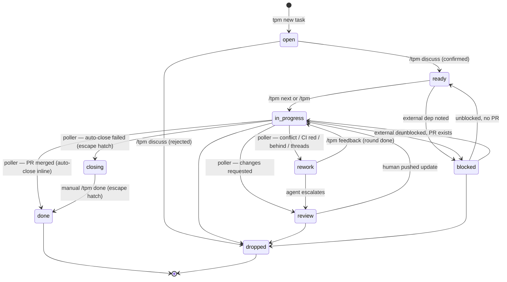

# tpm

[](https://github.com/htalat/tpm/actions/workflows/test.yml)

Markdown-based task & project manager. CLI-driven, agent-friendly. Zero deps — runs on Node 22.18+ via native TypeScript.

## Layout

This repo (the CLI install):
```
bin/tpm                            entry (bash shim → src/core/cli.ts)
bin/tpm.cmd                        entry (Windows shim → src/core/cli.ts)
src/core/                          orchestration, task tree, mutations, CLI dispatch (entry: src/core/cli.ts)
src/web/                           the web dashboard (`tpm serve`) + shared HTML/CSS
src/util/                          dependency-free helpers (markdown, frontmatter, time)
src/tui/                           reserved for the terminal UI (empty today)
.tpm/templates/                    distributed default templates
AGENTS.md                          agent-neutral guide for using tpm (safe to drop into other repos)
CONTRIBUTING.md                    shipping rules for the tpm CLI repo itself
skills/<name>/SKILL.md             user-scoped Claude Code skills (symlinked into ~/.claude/skills/)
.claude/skills/<name>/SKILL.md     repo-scoped Claude Code skills (auto-loaded only inside this repo)
docs/agents/                       per-agent setup notes (Claude Code, Codex, Copilot)
```

A tpm tree (data — lives wherever `tpm init` was run, e.g. `~/Documents/projects/`):
```
<root>/.tpm/templates/                          per-tree templates (copied from defaults)
<root>/.tpm/locks/<project>--<slug>.lock        per-task orchestrator locks (gitignore if syncing)
<root>/.tpm/events.ndjson                       append-only journal of status transitions (audit trail)
<root>/reports/index.html                       generated rollup
<root>/<slug>/project.md                        goals, context, notes, project log
<root>/<slug>/tasks/NNN-*/task.md               folder-form task (default; task.md + supporting files)
<root>/<slug>/tasks/NNN-*.md                    file-form task (legacy; one file, no folder)
<root>/<slug>/tasks/NNN-*/NNN-*.md              subtasks (`parent:` in frontmatter)
<root>/<slug>/tasks/NNN-*/...                   any other supporting files
<root>/<slug>/tasks/archive/NNN-*.md            archived file-form task
<root>/<slug>/tasks/archive/NNN-*/              archived folder-form parent (whole folder moved)
<root>/<slug>/tasks/archive/NNN-*/NNN-*.md      archived child of a still-live parent
<root>/<slug>/notes/                            free-form scratch
```

Project directories sit as siblings to `.tpm/` and `reports/` — no inner `projects/` nesting.

## Setup on a new device

Bootstraps the CLI, the data tree, and (optionally) the Claude Code skill from scratch. Steps assume zsh/bash on macOS or Linux. Adjust paths if `~/.local/bin` isn't already in your `$PATH`.

```sh
# 0. Prereq: Node 22.18+ (for native TypeScript execution). Verify:
node --version

# 1. Place the tpm repo somewhere stable.
git clone <your-tpm-remote> ~/Developer/tpm   # or copy/sync the directory
cd ~/Developer/tpm

# 2. Put the CLI on $PATH.
mkdir -p ~/.local/bin
ln -sf "$PWD/bin/tpm" ~/.local/bin/tpm
tpm --help                                    # sanity check

# 3. Bootstrap a data tree and write the user config.
tpm init ~/Documents/projects                 # writes ~/.tpm/config.json -> ~/Documents/projects
# or: tpm init                                # default ~/tpm
# or: tpm init ~/Dropbox/projects             # put data wherever you want it synced
tpm root                                      # confirms the tree root

# 4. (Optional) Install the user-scoped Claude Code skills.
# Walk every dir under skills/ and install it into ~/.claude/skills/.
# macOS/Linux: symlinks (so SKILL.md edits flow live).
# Windows:     recursive copy (symlinks need admin or Developer Mode); re-run
#              after editing a SKILL.md.
# Repo-scoped skills under .claude/skills/ are auto-loaded by Claude Code
# inside this repo and don't need installing — see "Skill scoping" below.
tpm refresh-skills
# Restart any running Claude Code session, then `/tpm` becomes available.

# 5. (Optional) Skip permission prompts for the tpm CLI.
# Add "Bash(tpm:*)" to permissions.allow in ~/.claude/settings.json.
# Easiest way is to ask Claude Code: "add Bash(tpm:*) to my user settings."
```

Verify end-to-end:

```sh
tpm new project sandbox --name "Sandbox" --repo https://github.com/you/sandbox --path ~/code/sandbox
tpm new task sandbox first-thing --title "First thing"
tpm ls
tpm context sandbox/first-thing | head -20
tpm report && open reports/index.html
```

### Skill scoping

Claude Code skills in this repo come in two flavors. The directory decides which:

- `skills/<name>/SKILL.md` — **user-scoped**. Useful from any repo (e.g. `/tpm` for tracking work). Installed into `~/.claude/skills/` by `tpm refresh-skills`; future additions are picked up the next time the command runs.
- `.claude/skills/<name>/SKILL.md` — **repo-scoped**. Only useful when working inside this repo (e.g. `/release` for cutting tpm releases). Auto-loaded by Claude Code when cwd is under the repo. No symlink, no setup step.

If a skill could go either way, force a choice. Useful outside the repo → user-scope. Otherwise → repo-scope. Don't add a third category.

### Syncing data across devices

The data tree (`~/tpm` or wherever) is just markdown. Easiest options:

- **Cloud folder**: put it in iCloud Drive, Dropbox, or similar; `tpm init <path>` on each device.
- **Git**: `git init` inside the tree, push to a private repo; clone on each device, then `tpm init <path>`.

The CLI install (this repo) and the data tree are independent — you can replace either without touching the other. `~/.tpm/config.json` is the only per-device pointer.

### Re-running setup (idempotency)

- `tpm init <path>` is safe to re-run — it only creates missing files and updates the config pointer.
- `tpm refresh-skills` is idempotent: existing symlinks pointing at the right source are left alone; stale links and copy-installs are replaced.
- On macOS/Linux the skill symlink picks up edits to `skills/tpm/SKILL.md` immediately; no restart needed for content changes (only for first install). On Windows the install is a copy, so re-run `tpm refresh-skills` after editing a `SKILL.md` to push the new contents into `~/.claude/skills/`.

## Install (TL;DR)

If you already have the repo and just want the CLI:

```sh
ln -s "$PWD/bin/tpm" ~/.local/bin/tpm
tpm init
```

### Windows

Same idea, different shim. `bin/tpm.cmd` is the Windows entry — drop a copy
(or a [`mklink`](https://learn.microsoft.com/windows-server/administration/windows-commands/mklink)
junction) under a directory on `%PATH%`, then `tpm` works the same as on
macOS/Linux. Requires Node 22.18+ for native TypeScript.

```cmd
:: From a cmd.exe inside the repo
mkdir "%USERPROFILE%\.local\bin" 2>nul
copy /Y "%CD%\bin\tpm.cmd" "%USERPROFILE%\.local\bin\tpm.cmd"
:: Ensure %USERPROFILE%\.local\bin is on PATH (one-time, via System Properties
:: → Environment Variables, or `setx PATH "%PATH%;%USERPROFILE%\.local\bin"`).
tpm init
```

PowerShell users can use `Copy-Item` or `New-Item -ItemType SymbolicLink`
instead — the `.cmd` is just a thin `node src/core/cli.ts %*` wrapper, so any
mechanism that puts it on `PATH` works.

## Setting up the harness

So far you have a tracker (`tpm new task`, `tpm ls`, `tpm context`). The **harness** is the optional automation around it: the two-queue lifecycle, the autonomous loop that drains the agent queue, the PR-signal poller that flips in-flight tasks based on review/CI state, the live dashboard you keep open while doing other things. tpm works as a plain CLI without any of it — turn on whatever you want.

### The two queues

tpm splits work across two inboxes:

| Status            | Queue       | Picked up by                      |
|-------------------|-------------|-----------------------------------|
| `open`            | human       | `tpm inbox` / manual triage       |
| `ready`           | agent       | `tpm next` → `/tpm <slug>`        |
| `rework`  | agent       | `tpm next` → `/tpm feedback <slug>` |
| `closing`     | human (alert) | poller auto-closes inline; stragglers land in `tpm inbox` for manual `/tpm done <slug>` |
| `in-progress`     | passive     | (work happening or waiting on review) |
| `review`    | human       | `tpm inbox` (agent escalated)     |
| `blocked`         | human       | `tpm inbox` (external dep)        |
| `done` / `dropped`| —           | (terminal)                        |

> **Migrating a pre-rename tree.** The `needs-*` statuses were renamed to one-word, actor-implying names: `needs-feedback` → `rework` (agent's turn), `needs-review` → `review` (human's turn), `needs-close` → `closing` (auto-close-failed alert). The new CLI treats the old names as unknown statuses (visible in `tpm ls`, ignored by the queues and the poller), so after updating the CLI run **`tpm migrate`** once per tree — it rewrites every task in place (live + archived), stamps a Log line per rewrite, and is idempotent. `tpm migrate --dry-run` previews.

`tpm next` selection priority: `rework` > stranded `in-progress` > `ready` (in-flight signal first, then reclaim, then new tasks). A task counts as "stranded" when its status is `in-progress` but no per-task lock file exists — the lock is the source of truth for "is someone working on this," and a released lock with a stuck status means a prior agent exited without cleaning up. `tpm next` admits the stranded task on the next tick — that in-process admission is the sole recovery mechanism. `closing` isn't dispatched — the PR-signal poller flips a merged PR's task to `closing` then immediately calls `tpm complete --outcome "<derived from PR title + body>"` in the same tick. Stragglers (auto-close failed: PR body empty, Outcome already filled, lock contention) stay at `closing` for the manual `/tpm done <slug>` escape hatch — they surface in `tpm inbox` (and the dashboard's Your-inbox section) as the top-ranked alert, or query directly with `tpm ls --status closing`. `tpm inbox` lists `closing`, `review`, `blocked`, and `open` cross-project, most actionable first.

Promotion `open` → `ready` is a deliberate human act. The canonical way is the `/tpm discuss <slug>` Claude Code skill mode, which shapes the task body via conversation and only flips status on explicit confirmation. Manual frontmatter edits also work.



The poller that flips `in-progress` → `done` (inline auto-close on merge) / `rework` / `review` is `tpm poll` — see [PR-signal poller](#pr-signal-poller) below.

The diagram is enforced, not just documented: every status write goes through the allow-list transition table in `src/core/transitions.ts`. Terminals (`done` / `dropped`) have exactly one exit (`tpm reopen`), `open` can't jump straight to a `needs-*` state, and the in-flight statuses are fully connected (operator, agent, and poller all legitimately move tasks between them). `tpm status <task> <new-status> --force` bypasses the table for repairing hand-mangled frontmatter. Every transition is also journaled to `<root>/.tpm/events.ndjson` (one NDJSON line: timestamp, task, from → to, verb, actor) — the audit trail for "who moved what, when".

### Drain the agent queue: three flavors

`tpm next` picks the next eligible task. Wrap it in one of three loops depending on how hands-off you want to be.

**1. Manual** — when you're around. From any Claude Code session, type `/tpm next`; the skill picks the slug and dispatches. No setup.

**2. Background tmux loop** — runs while your machine is on. Polls the queue; only fires against tasks you've explicitly opted in:

```sh
tmux new -d -s tpm-loop 'while sleep 60; do task=$(tpm next --autonomous) || continue; claude -p "/tpm $task"; done'
tmux attach -t tpm-loop          # peek
tmux kill-session -t tpm-loop    # stop
```

**3. Cron** — the most hands-off. `tpm orchestrate` defaults to a single-worker pool; bump `--workers N` to drain in parallel from one invocation:

```sh
which tpm                        # e.g. /opt/homebrew/bin/tpm
which claude                     # e.g. /opt/homebrew/bin/claude
crontab -e
```

```cron
# Every 5 minutes, fan out two concurrent workers (each claims its own task)
*/5 * * * * /opt/homebrew/bin/tpm orchestrate --workers 2 >> ~/.tpm/orchestrator.log 2>&1
```

Substitute the absolute paths from `which`. cron has a minimal `PATH`, so absolute paths are required. The machine must be awake and logged in for cron to fire.

Each worker gets an auto id (`worker-1`, `worker-2`, …) used as `TPM_AGENT_ID` for lock attribution and for the `agent=<worker-id>` prefix on its envelope log lines, so a merged log file still reads cleanly. `--minutes N` (default = global time bound) is the pool-shared deadline: workers stop picking new tasks once it passes and drain whatever's in flight. Per-task locks (`~/.tpm/locks/<slug>.lock`) deduplicate against sibling workers — no double-dispatch.

Mix CLIs across workers with `--cli claude,copilot,…` (length must equal `--workers`). Bin paths come from the per-CLI env var (`CLAUDE_BIN`, `COPILOT_BIN`), so a cron line can pin a specific binary without code changes.

`tpm lock list` is the live view of who's running what:

```
$ tpm lock list
PROJECT/SLUG                          AGENT-ID            ACQUIRED  HEARTBEAT
acme/refactor-auth                    nightly-runner      12m       12s
web/migrate-orm                       laptop-htalat-7421  3m        1s
```

Stale heartbeats (much larger than acquired-age) are visually obvious. `tpm lock release-stale` clears them; orchestrate runs that automatically on startup.

The `--autonomous` gate is the safety boundary between "an agent can run this when I ask" and "an agent can run this while I'm asleep." `tpm next --autonomous --claim` skips ready tasks unless they have `allow_orchestrator: true`. Promoting a task (`tpm ready`, or the serve "Promote to ready" button) sets that flag by default — the common case is shaped-and-safe-to-run-unattended — so opt _out_ per task with `tpm disallow <task>` when you want to be at the keyboard for it (destructive migration, risky refactor). The `--claim` flag turns the pick into an atomic claim (`O_CREAT | O_EXCL` on `<root>/.tpm/locks/<project>--<slug>.lock`) so multiple cron entries running in parallel don't double-dispatch on the same task.

`tpm orchestrate` (the dispatcher) layers several safety rails on top of a bare `claude -p` invocation:

- **Per-task lock** — atomic claim via `O_CREAT|O_EXCL`. The orchestrator heartbeats every 60s during the run so a sibling agent's stale-lock sweep doesn't reclaim it. Released on exit (success, timeout, or error). `tpm lock list` shows what's currently in flight; `tpm lock release-stale [--ttl <minutes>]` clears anything past TTL (default: time-bound + 5min). The legacy single global lock (`tpm lock acquire` with no task argument) still works for one release with a deprecation warning, then will be removed.
- **Same-repo strategy** — when two agents claim different tasks in the same `repo.local`, they collide on the working tree. Each project picks one of two strategies via the `same_repo_strategy` frontmatter field:
  - **`serialize`** (default) — adds a repo-level lock alongside each per-task lock. Only one task runs against a given repo at a time; tasks in *other* repos still run in parallel. `tpm next --claim` and `tpm orchestrate` both honor it; if the repo is busy, they fall through to the next eligible candidate. Safe for any repo size; caps same-repo throughput at 1 (which is usually correct — most teams don't want two LLMs editing the same checkout simultaneously).
  - **`worktree`** — *declared but not implemented in v0.* Each task would get its own `git worktree add` checkout, allowing same-repo parallelism at the cost of N working trees. The frontmatter field accepts the value (so projects can pre-declare intent), but `tpm orchestrate` and `tpm next --claim` currently refuse to dispatch worktree-strategy tasks. Implementation lands in a follow-up; until then, leave the field unset (or set to `serialize`) to use the harness.
- **Repo presence** — before spawning, the orchestrator resolves the project's `repo.local` and confirms it exists on disk (the agent's sandbox cwd has to be a real checkout). If `repo.local` is unset or the path isn't cloned yet, the task is flipped to `blocked` (the reason names the missing path) rather than skipped — so it surfaces in `tpm inbox` and drops off the `ready`/`rework` queue instead of re-failing and re-logging the same WARN on every tick. Clone (or `git init`) the repo, then `tpm ready <task>` to re-enter the autonomous queue. A task already blocked this way isn't re-blocked on a later tick.
- **Fresh main** — the execution prompt instructs the agent to `git checkout main && git pull --ff-only` before cutting its feature branch and to `tpm block` on a dirty tree or non-fast-forward. The rule also lives in `AGENTS.md` step 4 so manual `/tpm <slug>` runs follow it. PR #120 hit the canonical failure (agent branched off stale local main → conflict at merge); putting the check in the prompt covers both paths without a second source of truth.
- **Drift check** — `tpm drift-check <task>` refuses to dispatch if the project's `repo.local` is on a non-default branch or has uncommitted changes. Manual `/tpm <slug>` runs skip this; humans can knowingly work on a dirty tree.
- **Time bound + revert** — each dispatched run is hard-killed at the `time_bound_minutes` boundary (cascade: task > project > global config > built-in default 30m). On timeout, `tpm revert <task>` flips the task back to `ready` so the next cron tick can retry. Exit codes mirror `timeout(1)` (`124` on timeout). In pool mode, `--minutes N` is the orchestrate-wide deadline — workers stop picking new tasks once it passes and finish whatever's in flight.
- **Retry cap** — revert-to-ready means re-dispatch, so without a cap a perma-failing task burns an agent run on every tick forever. Each dispatch bumps `orchestrator_attempts` in the task's frontmatter; once it reaches `max_attempts` (cascade: task > project > global config > built-in default 3) the dispatcher auto-blocks the task instead of claiming it — it lands in `tpm inbox` with a reason pointing at the run logs. The counter clears when a run ships (PR/report delivered) or when a human re-promotes (`tpm ready` / `tpm reopen` — the explicit "try again"); the orchestrator's own revert keeps it, so the cap counts consecutive burned runs.
- **Worker pool** — `--workers N` (default 1) fans out N concurrent worker loops inside one orchestrate invocation. Each worker independently picks + claims its own task via the per-task lock — no cross-worker coordination needed. Worker ids (`worker-1`, `worker-2`, …) are used both for lock attribution and as the `agent=<id>` prefix on envelope log lines so a merged log file stays readable. Mix CLIs across slots with `--cli claude,copilot,…` (length must equal `--workers`).
- **Notifications** — desktop pings at start/finish/fail, gated by a `notifications` cascade (task > project > global config > default `{ start: false, finish: true, fail: true }`). Channels per platform: macOS uses `osascript`; Windows uses `powershell.exe` and prefers the [BurntToast](https://www.powershellgallery.com/packages/BurntToast) module (`Install-Module BurntToast` — optional but recommended), falling back to the built-in `Windows.UI.Notifications` WinRT API if BurntToast isn't installed; other platforms log to stderr and skip. `tpm notify <event> <task>` is the same hook as a CLI verb. **Clicking a notification opens the task's `tpm serve` page** (`<serve.url>/t/<project>/<slug>`): on macOS that needs [`terminal-notifier`](https://github.com/julienXX/terminal-notifier) on PATH (`brew install terminal-notifier` — optional; `osascript` has no click-action API, so without it the notification still fires, just non-clickable); on Windows the toast launches the URL as a protocol. The link only resolves while `tpm serve` is running — see `serve.url` under [Config fields](#config-fields).

**Agent CLI.** `tpm orchestrate` defaults to invoking `claude`. To dispatch via the GitHub Copilot CLI instead, set `agent: copilot` in task or project frontmatter (cascade: task > project > `agent` in `~/.tpm/config.json` > built-in default `claude`), or pass `--agent copilot` to the verb. The registry in `src/agent_cli.ts` lists the supported entries (today: `claude`, `copilot`); each entry knows the right NDJSON output flags and the non-interactive flag set (claude relies on `~/.claude/settings.json` plus task 085's prompt rule; copilot uses `--allow-all-tools --no-ask-user --autopilot`). Bin path comes from the matching env var — `CLAUDE_BIN`, `COPILOT_BIN` — so cron entries can pin a specific binary without code changes. For unattended copilot runs, the cron/launchd env also needs `COPILOT_GITHUB_TOKEN` (or `GH_TOKEN`). The per-run log carries a `# tpm-run agent=… outputFormat=…` header as its first line so `tpm serve`'s viewer dispatches on the right NDJSON dialect; pre-092 logs default to `claude-stream-json`.

### PR-signal poller

`tpm poll` is the in-process PR-signal poller. Walks every non-terminal task with a linked PR (plus every `in-progress` task — the round may open its PR mid-tick): `ready`, `in-progress`, `review`, `rework`, `closing`. The PR is alive across all of those — review states, CI runs, eventual merge — so the watch set spans the whole non-terminal lifecycle rather than just the in-flight slice. `open` / `blocked` / `done` / `dropped` are skipped. The rule lives in `shouldWatchForPrSignal` in `src/core/pr_signal.ts`. Each candidate dispatches to a host adapter per linked PR URL. Adapters ship for GitHub (`gh pr view`) and Azure DevOps (`az repos pr show` + `az pipelines runs list`); adding a new host is one file under `src/core/hosts/<name>.ts` plus an entry in the `HOSTS` array in `src/core/pr_signal.ts`. Each adapter answers the same coarse question in its own dialect — `merged` / `needs-agent` / `needs-human` / `abandoned` / `no-action` — so the harness never carries `if host === 'ado'` branches. Per-host CLI presence is checked inside the adapter (an ADO-only user doesn't need `gh` installed). Aggregated signal flips status to `rework` (merge conflict / CI red / branch behind / open threads — agent attempts the rebase and other fixes via `/tpm feedback`), `review` (`CHANGES_REQUESTED`, ADO vote ≤ -5, or a PR closed-without-merge — the human decides whether to reopen or drop), or **auto-closes inline** when any linked PR merged: flips to `closing`, derives an Outcome from PR title + body (Test plan + Claude Code footer stripped), and calls the same code path as `tpm complete --outcome "<derived>"` in the same tick. No claude session spawned, no orchestrator wait. If the inline auto-close fails (body empty, Outcome already filled, lock contention) the task stays at `closing` for manual `/tpm done <slug>`. `tpm poll --dry-run` previews decisions without mutating.

Cron pattern combining the signal poller and the drain:

```cron
# Every 15 min during work hours: flip in-flight PRs to rework / review
*/15 9-19 * * 1-5   /opt/homebrew/bin/tpm poll >> ~/.tpm/recurring-poll.log 2>&1
# Every 5 min: drain the agent queue with two concurrent workers
*/5 * * * *         /opt/homebrew/bin/tpm orchestrate --workers 2 >> ~/.tpm/orchestrator.log 2>&1
```

Or as a single long-running process (the equivalent of the cron pattern above) — `tpm loop` runs both loops with one Ctrl-C to stop:

```sh
tpm loop                                             # poll + orchestrate, every 60s
tpm loop --orchestrate-interval 300 --workers 2
tpm loop --once                                      # one pass of each, then exit
```

**Or the whole harness in one process** — `tpm up` supersedes the serve-in-one-pane + loop-in-another pattern. One supervisor owns the web UI, the PR-signal poll loop, and a daemon-mode orchestrate pool (no deadline — it drains the queue for as long as the process runs):

```sh
tpm up                                   # UI on :7777 + poller + 1-worker pool
tpm up --workers 2 --poll-interval 120
tpm up --workers 0                       # start parked: UI + poller only, scale up later
```

Because the pool lives in the same process as the UI, the index gains a **harness panel**: state chip (running / paused / draining), last poll outcome, and a workers stepper + pause/resume that write the same `workers` config knob the pool's reconcile tick already hot-reloads (so the controls also steer an external cron pool). `/api/harness` serves the same snapshot as JSON. Stale-lock hygiene runs on every poll tick — a daemon that runs for days keeps sweeping crashed agents' locks, not just at startup. Ctrl-C drains gracefully (in-flight tasks finish; press again to force-exit — the stale-lock sweep and stranded re-admission recover whatever a force-exit strands). Stop a single running task from the UI with its **Pull** button (the run's terminal-state poll SIGTERMs the agent within ~5s), or scale to 0 to pause the whole pool.

Two independent loops (a slow orchestrate tick never blocks a poll tick); SIGINT/SIGTERM kills the in-flight child and exits. It's a faithful port of the bash one-liner this section used to carry — `trap 'kill 0' EXIT` plus two backgrounded `while true; do …; sleep; done` loops — kept as TypeScript so there's no second language to maintain. Each tick runs as a child `tpm` (resolved via `$TPM_BIN` → this install's `bin/tpm` → bare `tpm` on PATH, same as `tpm schedule`), so a crashing tick can't take the loop down.

`tpm orchestrate` and `tpm poll` emit one structured line per event so a single log file greps + sorts cleanly:

```
2026-05-15T09:14:33-07:00  INFO   poll             no tasks to watch
2026-05-15T09:14:35-07:00  INFO   poll             decide tpm/040-serve-mutations pr=https://… host=github action=no-signal reason=no-action
2026-05-15T09:14:36-07:00  INFO   poll             flipped tpm/041-foo -> rework (CI FAIL on https://…)
2026-05-15T09:14:37-07:00  INFO   poll             decide tpm/043-baz pr=https://… host=ado action=skip reason=throttled (age=4m, floor=15m)
2026-05-15T09:14:37-07:00  INFO   poll             auto-closed tpm/042-bar (merged https://…)
2026-05-15T09:14:38-07:00  INFO   poll             summary checked=6 flipped=2 no-signal=3 fetch-failed=1 throttled=1
```

ISO-8601 second precision in the configured TZ (from `~/.tpm/config.json`, falls back to UTC) with explicit `±HH:MM` offset; level padded to 5 chars; script padded to 16 chars; free-form single-line message. The format is lexicographically sortable within a single TZ (DST transitions stay ordered because the offset is part of the string) and unambiguous if logs are ever shipped cross-host. INFO/WARN write to stdout, ERROR to stderr (cron's `>> log 2>&1` collapses both — the split is for interactive runs that want `2>/dev/null` for warn-free output). `grep -E '^\d{4}.*ERROR' ~/.tpm/*.log` returns only the actual errors; `grep 'action=no-signal'` shows everything the poller passed on. A PR whose cached snapshot is younger than its configured floor logs `action=skip reason=throttled` and increments `throttled` instead of being fetched (see the [`poll` config field](#config-fields)). The summary line's `checked=N flipped=N no-signal=N fetch-failed=N` are per-task and add up to `checked`; `throttled=N` is a per-PR count of skipped fetches (orthogonal — a task whose every PR was throttled contributes to neither `flipped` nor `no-signal`).

#### `tpm schedule` (cross-platform scheduler wrapper)

`tpm schedule` writes the recurring-job entry for you instead of asking you to hand-edit `crontab` / Task Scheduler. Same verbs everywhere:

```sh
tpm schedule install poll --every 60 -- tpm poll
tpm schedule install nightly --every 14400 -- tpm orchestrate --task my-project/some-task
tpm schedule list                              # poll, nightly
tpm schedule status poll                       # installed
tpm schedule uninstall poll
```

**Linux** — default writer is **systemd `--user`**: writes `~/.config/systemd/user/tpm-<name>.{service,timer}` (Type=oneshot service, OnUnitActiveSec timer), then runs `systemctl --user daemon-reload && systemctl --user enable --now tpm-<name>.timer`. Survives reboots because the unit is enabled; `Persistent=true` catches up missed runs after the user session reappears.

**Linux fallback to crontab**: if `systemctl --user show-environment` exits non-zero (no user manager, e.g. SSH-as-non-login or a container without systemd-user), the same verb writes/removes a crontab line tagged with a `# tpm:<name>` sentinel — the sentinel makes `uninstall` idempotent and dupe-free across re-installs. Both writers preserve unrelated entries.

**Windows** — writer is **Task Scheduler** via `schtasks.exe`: shells out to `schtasks /Create /TN tpm-<name> /SC MINUTE /MO <minutes> /TR "<cmd>" /RU <current-user> /IT /F`. Tasks land at the root of the Task Scheduler library (visible in `taskschd.msc` as `tpm-poll`, `tpm-orchestrate`, etc.); `/IT` keeps the job in the current user's interactive context so no admin / password setup is required. `--every` is rounded to whole minutes (schtasks' `/SC MINUTE` minimum), which is fine for the typical 15-minute cadence. `list` / `status` / `uninstall` operate via `schtasks /Query` and `schtasks /Delete /F`.

**macOS:** `tpm schedule` is not yet wired up on Darwin — the launchd adapter is a follow-up (separate task). For now, stick with the manual `crontab` examples above on macOS.

A bare `tpm` as the command (i.e. `-- tpm <args>`) is auto-resolved to this install's absolute `bin/tpm` so the unit/cron/Task Scheduler line keeps working under the stripped `PATH` that systemd-user, cron, and schtasks all see. Override with `TPM_BIN=/abs/path/to/tpm tpm schedule install ...` if you keep multiple installs. On Windows, the binary install shim lands in a follow-up task — until then, pass an absolute path to your `tpm.cmd` (or whatever shim you've wired up) instead of bare `tpm`.

### Live dashboard

`tpm serve` starts a localhost HTTP UI at `http://127.0.0.1:7777` rendering the same tree as a tab you keep open. Read views auto-refresh; the task view also exposes status-gated forms that shell out to the CLI for every mutation (no parallel writer).

```sh
tmux new -d -s tpm-web 'tpm serve'
open http://127.0.0.1:7777
tmux kill-session -t tpm-web     # stop
```

Live updates ride two rails: the soft-poll interval (every 5–30s depending on the page) stays as the fallback, and `/events` — a server-sent-events stream tailing the status journal (`<root>/.tpm/events.ndjson`) — pushes every transition to open tabs within ~1s, no matter which process made it (an agent's `tpm pr`, a cron poller flip, another tab). The index also renders an **Activity** feed (the journal's newest entries: who moved what, when) and — under `tpm up` — the harness panel described above. On a task's `/runs` page, an in-progress run streams **live**: a 2-second incremental tail (`…/runs/<name>/tail?offset=N`) appends new transcript events as the agent emits them — byte-offset framed, so you watch tool calls land in near-real-time instead of waiting for a page refresh.

Routes: `/search?q=<text>` (global task search — case-insensitive over slug, title, status, tags, PR URLs, and body, slug/title hits ranked first, body hits shown with a highlighted snippet; the masthead search box on every page lands here; `&archived=1` widens to archived tasks), `/` (Your inbox / Agent queue / In flight / Activity, with a project-chip nav across the top to jump into any project; append `?project=<slug>` to filter the queues; rows for tasks with linked PRs carry a `[PR #N <state>]` chip linking out to GitHub), `/p/<project>` (project view — sidebar with project frontmatter, rendered Goal / Context / Notes / Log, and tasks grouped by status; archived tasks hidden by default, append `?archived=1` or use the "Show archived" toggle), `/t/<project>/<slug>` (task view with rendered Context / Plan / Log / Outcome, a PR panel — one card per linked PR with state / CI / review / mergeable badges + a GitHub link — and an Actions panel; resolves archived tasks too), `/api/refresh` (JSON for client polling). Auto-refreshes every 30s via meta-refresh — no JS framework. The markdown subset rendered in task bodies covers headings, lists, fenced code, links, and basic emphasis; intentionally rejects GFM tables / footnotes (write HTML in the body if you need them).

The PR panel reads host-native PR snapshots cached at `~/.tpm/pr-cache/<host-namespaced-path>.json` (GitHub: `<owner>/<repo>/<number>.json`; Azure DevOps: `ado/<org>/<project>/<repo>/<id>.json`), written by `tpm poll` on each tick — stale-while-revalidate, so the page renders instantly and the badges are at most one poll interval old (the "fetched X ago" hint says when). A cache miss or a snapshot older than an hour renders a placeholder instead of blocking on a live `gh` / `az` call; it fills in on the next poll. The rich badge set (CI rollup / mergeable / review decision) is GitHub-only today; ADO entries currently render a minimal card with the host label — host-idiomatic ADO rendering (vote scores, policy state) is a follow-up.

Mutations are POST endpoints (`/t/<project>/<slug>/<action>`) backing the Actions panel. Each shells out to the matching CLI verb (`ready`, `block`, `reopen`, `complete`, `log`, `pr`, `status`, `allow-orchestrator`, `archive`) and 303-redirects back to the task view with the CLI's stdout/stderr surfaced as a flash banner. Safety: mutations register only when the server is bound to loopback; explicit `--host 0.0.0.0` disables them with a startup warning. A same-origin check on `Origin`/`Referer` blocks drive-by cross-tab POSTs. No auth, no CSRF token — single-user, localhost-only.

### Per-repo wiring

For each project the harness touches, the agent needs a couple of fields in `project.md` frontmatter:

- **`repo.local`** — absolute path to the working tree. `tpm context` surfaces it; `tpm path <task>` prints it. Without it, `tpm orchestrate` and `/tpm <task>` can't `cd` into the repo. The one field that's effectively required for harness use.
- **`repo.remote`** — URL. Used by `tpm report` and the live dashboard to link out.
- **`host: github | ado`** *(optional, default `github`)* — informational. Used by the agent's `/tpm feedback` mode to pick which CLI to run (`gh` vs `az repos pr`). The PR-signal poller doesn't gate on this field — it routes per linked PR URL via the host registry in `src/core/pr_signal.ts`, so a task that links both a GitHub and an ADO PR (rare but valid) gets both adapters dispatched on the same tick.
- **`workflow: <path>`** *(optional)* — relative path inside the repo to the doc agents follow when shipping (commit style, validation, PR conventions, when to close). If unset, the agent looks for `AGENTS.md` then `CLAUDE.md` in the repo root, then asks before each shipping step. See [Per-repo workflow](#per-repo-workflow).

For agents that read `AGENTS.md` (Claude Code, Codex CLI, Copilot via symlink), drop a tpm-aware `AGENTS.md` at the repo root — the [tpm CLI repo's own `AGENTS.md`](AGENTS.md) is a working example. Per-agent setup details: [Using tpm with an AI coding agent](#using-tpm-with-an-ai-coding-agent).

Optional per-task overrides (drop into a task's frontmatter, tightest cascade win):

- `repo:` — task-level repo override (e.g., a child task that lives in a different checkout).
- `workflow:` — different shipping doc for this task.
- `time_bound_minutes` — tighter or looser cap than the project default.
- `notifications:` — flip a specific event for this task.
- `allow_orchestrator: true` — opt in to the unattended drain.

### Verifying end-to-end

After wiring everything up, exercise the loop against a sandbox project to confirm intake → drain → done works:

```sh
# 1. Make a sandbox project pointing at any repo (a throwaway is fine).
tpm new project sandbox --path ~/sandbox-repo

# 2. Create a tiny task and shape it.
tpm new task sandbox hello-world --title "Print hello world"
$EDITOR "$(tpm root)/sandbox/tasks/001-hello-world.md"   # add a Plan, set type: pr
tpm ready sandbox/hello-world

# 3. Drain manually first.
task=$(tpm next --project sandbox)
echo "$task"                              # sandbox/hello-world
# /tpm $task   from a Claude Code session, or:
claude -p "/tpm $task"

# 4. Run via orchestrate. `tpm ready` (step 2) already set allow_orchestrator: true,
#    so the task is autonomous-eligible — run `tpm disallow sandbox/hello-world` first
#    if you'd rather keep it manual-only.
tpm orchestrate --minutes 5

# 5. Confirm closure.
tpm ls --status done --project sandbox
tpm context sandbox/hello-world | tail -20    # check the Outcome section
```

The walkthrough exercises every harness piece: project + task creation, the `open` → `ready` gate, manual `tpm next`, the `--autonomous` filter, `tpm orchestrate`'s spawn + time bound + revert, and the close-out flow. If any step surprises you, the diagnostic order is:

- `tpm ls --all --project sandbox` — current frontmatter state.
- `tpm lock list` — what's currently locked, and by which agent?
- `tpm drift-check sandbox` — is the working tree clean?
- `~/.tpm/orchestrator-<agent-id>.log` (or wherever you redirected) — agent stdout/stderr from the last run.

## Commands

```sh
tpm init [<dir>]                          # bootstrap a tree (default: ~/tpm)
tpm new project <slug> [--name "Pretty Name"] [--repo <url>] [--path <local-dir>]
tpm new task <project> <slug> [--title "Pretty Title"] [--parent <parent-slug>]
tpm ls [--all] [--archived] [--flat] [--status open] [--project <slug>]
tpm context <task | project/task | parent/child>
tpm start <task>                          # set status: in-progress, log started
tpm ready <task>                          # set status: ready (+ allow_orchestrator: true), log promoted
tpm complete <task> [--outcome "..."] [--no-archive] [--archive]
                                          # set status: done, stamp closed, log;
                                          # archives by type (pr yes, investigation no)
tpm block <task> "<reason>"               # set status: blocked, log the reason
tpm reopen <task> ["<reason>"]            # set status: open, log reopened (optional reason)
tpm revert <task> ["<reason>"]            # flip in-progress -> ready, log a timeout/revert (no-op otherwise)
tpm status <task> <new-status> [--force]  # generic status setter, validated against the
                                          # transition table (src/core/transitions.ts);
                                          # --force bypasses (repair hatch)
tpm log <task> "<message>"                # append a single timestamped Log line
tpm pr <task> <url>                       # add URL to prs:, log opened PR
tpm report <task>                         # attach a report artifact to an investigation task
                                          # at <project>/tasks/<slug>/report.md (auto-folds file-form tasks);
                                          # auto-flips in-progress -> review (investigation analogue of tpm pr)
tpm report <task> --export text           # print the report as plain text (drops HTML comments)
tpm lgtm <task>                           # reviewer LGTM on a report task: derive Outcome + complete
tpm request-changes <task> "<comment>"    # reviewer pushback: append to ## Reviewer feedback + flip to rework
tpm archive <task | project/task>         # move a done/dropped task (or whole folder-form parent) to tasks/archive/
tpm fold <task | project/task>            # promote a file-form task to folder-form (idempotent)
tpm reparent <task> <new-parent | --top>  # move a task under a new parent (or to top-level); folds the new parent if needed
tpm next [--project <slug>] [--autonomous] [--claim <id>]  # print next leaf task (--claim atomically locks it); exits non-zero if none/all-locked
tpm inbox                                 # list human-queue tasks (review, blocked, open) cross-project
tpm orchestrate [--minutes <N>] [--agent <name>] [--claude <path>] [--task <slug>]  # claim next --autonomous (or use --task pre-claimed) and run the agent CLI (claude, copilot, …) with a hard time bound; --claude <path> is a back-compat alias pinning the agent to claude with a bin override
tpm lock acquire <task> --as <id>         # claim a per-task lock (atomic O_CREAT|O_EXCL)
tpm lock release <task> --as <id> [--force]  # release a per-task lock
tpm lock heartbeat <task> --as <id>       # refresh a held lock so stale-lock sweeps don't reclaim it
tpm lock status [<task>]                  # holder + age (legacy global if no task)
tpm lock list                             # every claimed task across the tree
tpm lock release-stale [--ttl <minutes>]  # clear locks past TTL (default: time-bound + 5min)
tpm notify <start|finish|fail> <task>     # best-effort desktop notification (macOS osascript / Windows powershell + BurntToast; cascade: task > project > global)
tpm schedule install <name> --every <sec> -- <cmd> [args...]  # install a recurring job (Linux: systemd --user timer / cron fallback; Windows: Task Scheduler via schtasks)
tpm schedule uninstall <name>             # remove a tpm-managed scheduled job
tpm schedule status [<name>]              # named: installed | missing; bare: list everything installed
tpm schedule list                         # names of all tpm-managed jobs (one per line)
tpm serve [--port 7777] [--host 127.0.0.1]  # start a localhost HTTP UI (read + status-gated mutation forms)
tpm up [--port 7777] [--workers N] [--poll-interval 60] [--agent <name>]
                                          # the whole harness in one process: web UI + PR-signal
                                          # poller + daemon-mode orchestrate pool (no deadline;
                                          # Ctrl-C drains, twice force-exits)
tpm report [--md]                         # rollup of every project/task -> reports/index.{html,md}
tpm root                                  # print the tree root
tpm path <project | task | project/task>  # print the local checkout path
tpm now                                   # timestamp in the configured timezone
```

The mutation verbs (`start`, `ready`, `complete`, `block`, `reopen`, `status`, `log`, `pr`) let you change task state without ever loading the file into an editor or chat context. Each verb does one read → mutate → write inside a single process; idempotent where it makes sense (re-running `tpm start` on an in-progress task is a no-op). For body-text authoring (Context, Plan, Outcome) you still edit the file directly — the CLI deliberately doesn't ship a markdown section editor.

### Linking projects to repos

Each project can record its repo (remote URL + local checkout path). Tasks inherit by default; set `repo:` on a task to override.

```yaml
# projects/<slug>/project.md
repo:
  remote: https://github.com/owner/repo
  local:  /Users/you/code/repo
```

`tpm context` includes both in the briefing and tells the agent to `cd` into the local path. `tpm report` links the remote in each project header. `tpm path some-task` prints the local path so you can `cd $(tpm path some-task)` from the shell.

## Where does my data live?

Wherever `~/.tpm/config.json` says — written by `tpm init`. One source, no overrides. To switch trees, run `tpm init <other-dir>`.

```sh
tpm root              # /Users/you/tpm
cat ~/.tpm/config.json
```

### Config fields

```json
{
  "root": "/Users/you/Documents/projects",
  "timezone": "America/Los_Angeles",
  "time_bound_minutes": 30,
  "notifications": { "start": false, "finish": true, "fail": true },
  "serve": { "url": "http://127.0.0.1:7777" },
  "poll": { "min_interval_minutes": 5, "per_host": { "ado": { "min_interval_minutes": 15 } } }
}
```

- `root` — tree root, set by `tpm init <dir>`.
- `timezone` — IANA name (e.g. `America/Los_Angeles`, `Europe/Berlin`, `UTC`); used for `created`, `closed`, log entries, and report timestamps. Handles DST automatically (PST/PDT). Defaults to `America/Los_Angeles` if absent. Run `tpm now` to see the current timestamp in the configured zone.
- `time_bound_minutes` — global default for `tpm orchestrate`'s hard time bound. Positive integer. Defaults to 30 if absent. Project and task frontmatter can override per-scope (see [Scheduling unattended runs](#scheduling-unattended-runs-cron)).
- `notifications` — global default for `tpm orchestrate`'s system-notification calls. Three independent boolean keys: `start` / `finish` / `fail`. Default `{ start: false, finish: true, fail: true }` — quiet on every cron tick, visible on completion + failure. Project and task frontmatter can override per-scope (cascade: task > project > global). Channels: macOS `osascript`; Windows `powershell.exe` (BurntToast preferred — `Install-Module BurntToast` — WinRT fallback otherwise); other platforms log to stderr.
- `serve` — `{ "url": "..." }`, the base URL clicking a notification deep-links into (`<url>/t/<project>/<slug>`). Defaults to `http://127.0.0.1:7777` (the `tpm serve` default host/port); set it if you run serve on a non-default `--port`/`--host`. Hand-edited only — there's no `tpm config set serve.url` setter. The link resolves only while `tpm serve` is up; clicking when it's down lands the browser on a connection error.
- `max_attempts` — orchestrator retry cap: runs a task gets before the dispatcher auto-blocks it instead of re-claiming (default 3; task/project frontmatter override, tightest cascade win). See the retry-cap rail under [Setting up the harness](#setting-up-the-harness).
- `poll` — per-PR fetch floor for the `tpm poll` PR-signal poller: it skips any PR whose cached snapshot is younger than the floor, so a fast cron stops re-hitting the host API for PRs that haven't moved. `min_interval_minutes` is the global floor; `per_host.<host>.min_interval_minutes` overrides it for a single host (`github`, `ado`, …). Resolution is `per_host[host] ?? min_interval_minutes ?? built-in default`. The built-in defaults are deliberately ADO-friendly: **5 minutes globally, 15 for `ado`** — so an unconfigured tree keeps GitHub responsive while it stops hammering ADO. Positive integers only. `tpm poll --force` (alias `--no-throttle`) bypasses the floor for a manual diagnostic run; cron uses the throttled path. The throttled-PR count surfaces in the poller's `summary … throttled=N` log line.

## Frontmatter schema

**`<root>/<slug>/project.md`**
```yaml
name: Pretty Name
slug: my-project
status: active        # active | paused | done | archived
created: 2026-04-25 09:30 PDT
repo:
  remote: https://github.com/owner/repo
  local:  /Users/you/code/repo
host: github          # github | ado — informational; agents read it to pick gh vs az repos pr. The PR-signal poller routes per URL via the host registry and ignores this field. Default github.
tags: []
workflow: AGENTS.md   # optional: path (relative to repo root) to the doc agents follow when shipping work
time_bound_minutes: 45  # optional: per-project override for `tpm orchestrate` hard time bound (positive int)
max_attempts: 5       # optional: per-project override for the orchestrator retry cap (default 3)
notifications:        # optional: per-project override for orchestrator notifications (any subset of keys)
  fail: false         #   silence the fail ping for this project; inherit start/finish from global
same_repo_strategy: serialize  # serialize | worktree — how parallel agents share repo.local. Default serialize.
```

**`<root>/<slug>/tasks/NNN-<slug>/task.md`** (top-level task; legacy file-form tasks live at `tasks/NNN-<slug>.md`)
```yaml
title: Refactor auth middleware
slug: refactor-auth
project: my-project
status: open          # open | ready | in-progress | rework | closing | review | blocked | done | dropped
type: pr              # pr | investigation
created: 2026-04-25 09:30 PDT
closed:               # YYYY-MM-DD HH:MM ZZZ when status flips to done
prs: []               # list of PR URLs
tags: []
parent: NNN-foo       # optional: marks this as a child within a folder-form parent
workflow: AGENTS.md   # optional: per-task workflow override; falls back to project.workflow if unset
time_bound_minutes: 15  # optional: per-task override for `tpm orchestrate` hard time bound; tightest cascade win
max_attempts: 5       # optional: per-task override for the orchestrator retry cap (default 3)
orchestrator_attempts: 2  # managed by the orchestrator: runs burned since the last ship/re-promote; don't hand-edit
notifications:        # optional: per-task override for orchestrator notifications (tightest cascade win)
  start: true         #   ping when this task starts (e.g. for a long-running task you want to know kicked off)
```

Timestamps are written in the timezone from `~/.tpm/config.json` (default `America/Los_Angeles`). Old date-only values (`2026-04-25`) keep parsing — values are display strings only.

Edit the markdown freely — frontmatter is the source of truth for `tpm ls` and `tpm report`. Task bodies use `## Context / ## Plan / ## Log / ## Outcome`. Project bodies use `## Goal / ## Context / ## Notes / ## Log`. The project `## Log` is a timeline for events that don't belong to any single task (pivots, milestones, decisions that span tasks); per-task events stay in the task's own Log.

`tpm ls` hides `done` and `dropped` tasks by default. Use `--all` to include every active task status, `--status done` to query a specific status, or `--archived` to include tasks moved under `tasks/archive/`. `tpm context` and `tpm path` still resolve archived tasks, and new task numbering counts both active and archived task files.

## Hierarchical tasks (folder form)

A task is one of two shapes:

- **Folder form** (default): `tasks/NNN-slug/task.md`. New top-level tasks are created in this shape, so subtasks, scratch notes, screenshots, `runs/`, and `report.md` have a home without a later conversion.
- **File form** (legacy): `tasks/NNN-slug.md`. A single file with no folder. Pre-folder-form top-level tasks still load this way and auto-fold when they gain a child, run, or report. Child tasks are always flat `.md` files inside their parent's folder.

Subtasks are first-class tasks with their own status, PRs, and log. They live alongside `task.md` inside the parent's folder, with `parent: <parent-slug>` in their frontmatter:

```
tasks/004-orchestrator-hardening/
  task.md                    # parent: high-level overview, links to children
  001-lock-file.md           # parent: 004-orchestrator-hardening
  002-drift-check.md         # parent: 004-orchestrator-hardening
  003-time-bound.md          # parent: 004-orchestrator-hardening
  notes-from-call.md         # arbitrary supporting file — tpm doesn't care
```

A task with any children is a **container**: it isn't actionable, never appears in `tpm next`, and `tpm ls` shows a roll-up status (any child in-progress → in-progress; all children done → done; otherwise the parent's own declared status). The roll-up is display only — `tpm` never auto-changes the parent's frontmatter.

### Working with folder form

```sh
tpm fold <task>                                  # promote NNN-slug.md → NNN-slug/task.md (idempotent)
tpm new task <project> <child> --parent <slug>   # creates a child inside the parent's folder
                                                 # folds the parent automatically if needed
                                                 # numbering is scoped to the parent folder
tpm reparent <task> <new-parent>                 # move a top-level task under a parent
                                                 # (or a child between parents); folds the new parent if needed;
                                                 # renumbers within the destination
tpm reparent <task> --top                        # promote a child back to top-level (drops parent: from frontmatter)
tpm ls --flat                                    # flatten the tree (skip indentation)
```

Only one level of nesting is supported — both `--parent` and `reparent` reject an attempt to nest under a child task. `reparent` also refuses to move a task that is itself a parent (would create grandchildren). A folder-form task (now the default) moves fine when `task.md` is its only file; if it holds supporting files (`runs/`, `report.md`, children) the move is refused to avoid orphaning them — flatten manually first.

### Slug resolution

A bare slug (`/tpm hierarchical-tasks`) works when it's globally unambiguous. If two tasks could match (e.g., two children named `discuss` under different parents), the CLI errors and asks you to qualify it. Qualified forms:

- `<project>/<task>` — top-level task
- `<parent>/<child>` — child within a single project
- `<project>/<parent>/<child>` — fully qualified

### Archive layout

- `tpm archive <task>` on a folder-form parent moves the whole folder to `tasks/archive/<parent>/`. The parent must have no live children.
- `tpm archive <child>` moves just the child file to `tasks/archive/<parent>/<child>.md`. The live parent stays in place.

## Per-repo workflow

Different repos need different shipping flows — a solo repo direct-pushes to main, a team repo always PRs, a sensitive repo uses draft PRs and waits for human review. tpm doesn't enumerate strategies; it points the agent at the repo's own workflow doc.

`tpm context` surfaces a `Workflow:` line in the briefing whenever the field is set, and the working agreement names the resolution chain the agent follows after `cd`-ing into `repo.local`:

1. If `workflow:` is set on the task or project, read that file (path relative to the repo root).
2. Else look for `AGENTS.md`, then `CLAUDE.md`, in the repo root.
3. Else ask before each shipping step (commit, push, PR, close).

The doc itself is free-form prose. Tell the agent what to validate, where commits go, when to open a PR vs draft, when to close the task. Example shape:

```markdown
## Workflow

- Validate: `npm test` must pass before commit.
- Direct-push to `main` for doc-only changes; PR for behavior changes.
- For PR-typed tasks, leave the task in-progress after opening the PR; close after merge.
```

Per-task `workflow:` overrides the project default — useful for one-off sensitive work in an otherwise direct-push repo.

## Delegating to a coding agent

```sh
tpm context my-project/refactor-auth | claude
# or paste the output into any chat agent
```

`tpm context` emits a self-contained briefing: project goal, task body, file path, and a working agreement that tells the agent where to log progress and update status.

### Using tpm with an AI coding agent

`AGENTS.md` is the canonical, agent-neutral guide — CLI cheatsheet, schema, slug resolution, action procedures, conventions. Per-agent setup lives under `docs/agents/`:

- [Claude Code](docs/agents/claude-code.md) — `/tpm` slash command via the user-scoped skill at `skills/tpm/`.
- [OpenAI Codex CLI](docs/agents/codex.md) — auto-loads `AGENTS.md` at the repo root; invoke actions in natural language.
- [GitHub Copilot](docs/agents/copilot.md) — symlink `AGENTS.md` to `.github/copilot-instructions.md`.

For other agents, the working agreement in `tpm context` and `AGENTS.md` should be enough — paste them in or point the agent at the files.

## Reports

```sh
tpm report           # writes reports/index.html (open it in a browser)
tpm report --md      # writes reports/index.md
```

The HTML report is one self-contained file with no external assets. Dark mode supported via `prefers-color-scheme`.

## Tests

```sh
npm test                                  # runs every src/**/*.test.ts
node --test src/util/frontmatter.test.ts  # one file
node --test --test-name-pattern=archive src/core/tree.test.ts
```

Uses Node's built-in test runner (`node --test`) and `node:assert/strict`. No install step — the suite has zero dependencies, same as the CLI. Tests are colocated with source as `*.test.ts` and create their own temp dirs; nothing touches `~/.tpm` because each test file re-homes the process via `src/_test_helpers.ts`.

## Cutting a release

Two layers — pick the right one for the situation.

**`/release` skill** (recommended): drafts notes from commits since the last tag, recommends a SemVer bump, dispatches the script after you confirm.

```
/release                # recommend bump from commits, draft notes, ask, then ship
/release patch          # skip the recommendation, draft patch notes
/release minor
/release major
```

The skill lives at `.claude/skills/release/` and is repo-scoped — Claude Code auto-loads it whenever cwd is inside this repo, no install step.

**`scripts/release.sh`** (mechanical, no agent): when you already know the bump and have notes ready (or want to use GitHub's auto-generated notes).

```sh
npm run release -- patch                                    # auto-generated notes
npm run release -- minor --notes RELEASE_NOTES.md           # use a notes file
./scripts/release.sh major --notes RELEASE_NOTES.md         # same, direct invocation
```

The script aborts loudly on any precondition failure: not on `main`, dirty tree, behind/ahead of `origin/main`, tests fail, tag already exists, `package.json` version drifted from the latest tag. It commits the version bump, creates an annotated tag, pushes, and runs `gh release create`. The release URL is printed on success.

### SemVer cadence

- **patch** — bug fixes, doc-only changes, no new behavior.
- **minor** — new features, backward-compatible.
- **major** — breaking schema/CLI changes.
- Stay at 0.x while the schema is in flux; bump to 1.0.0 when the frontmatter shape and CLI verbs feel locked.
