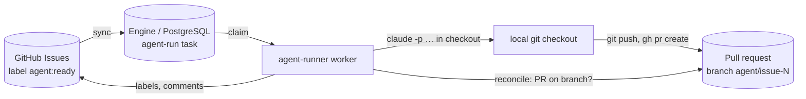

# agent-runner

Runs coding agents (Claude Code, Copilot CLI, …) on tracker items and hands the
result back as a pull request. It replaces the `orchestrate` part of the older
`tpm` tool. The task tracker itself is no longer ours: GitHub Issues is the
source of truth for _what_ to do; the engine is the source of truth for
_execution_.



## Lifecycle of one item

| Issue label     | Meaning                                   | Set by                  |
| --------------- | ----------------------------------------- | ----------------------- |
| `agent:ready`   | A human opts the issue in                 | human                   |
| `agent:running` | A run has started                         | `start` step            |
| `agent:review`  | The agent opened a PR; a human reviews it | `finish` step           |
| `agent:failed`  | The run failed; the comment says why      | compensation of `start` |

To retry a failed item, or to ask for another round after review, add
`agent:ready` again. Each time creates a new run (round 2, 3, …).

## The `agent-run` workflow

```
start   tracker: ready -> running, comment            compensate: running -> failed, comment
agent   agent CLI in the checkout                     one per repo (concurrency group); reconcile = PR on branch?
finish  tracker: running -> review, comment with PR
```

- **Success is durable evidence, not an exit code**: the step succeeds when a PR
  exists on the deterministic branch `agent/issue-<number>`.
- **Crash after the PR was opened**: the lease expires, the attempt is AMBIGUOUS,
  the retry runs `reconcile`, finds the PR and completes without starting the
  agent again (tested with real processes in `tests/e2e/agent-runner.test.ts`).
- **One agent per checkout**: `concurrencyGroup: { key: repo, limit: 1 }`.
  Other repos run in parallel.
- **Dirty checkout or wrong branch**: POLICY failure, no retry, issue labelled
  `agent:failed` with the reason (a human must look).
- **Provider usage limit** (e.g. "Claude usage limit reached"): TRANSIENT with
  `chargeAttempt: false` and the reset time from the output (default 30 min,
  max 6 h). It does not use up one of the 3 attempts.
- **Time bound** (`timeBoundMinutes`, default 30): the worker kills the agent's
  whole process group; TIMEOUT, retried.
- **Agent exits without a PR**: TRANSIENT, retried (backoff from 60 s); after
  3 attempts the run fails and compensation labels the issue `agent:failed`.
- **Every tracker write is idempotent**: label edits converge, and comments
  carry a hidden `<!-- durable:<idempotency key> -->` marker that is checked
  before posting.

## Setup

1. `gh auth login` (the GitHub adapter uses the `gh` CLI).
2. `cp agent-runner.config.example.json agent-runner.config.json` and list
   your repos with their local checkout paths.
3. Create the labels once: `npm run agent-runner -- labels`.
4. Run the engine (`npm run api`, `npm run orchestrator`) and:

```bash
npm run agent-runner -- sync     # polls GitHub every syncIntervalMs
npm run agent-runner -- worker   # runs agents (WORKER_CONCURRENCY, LEASE_MS)
```

`claude` must be on `PATH` and allowed to run non-interactively (or set
`CLAUDE_BIN`). For Copilot set `"agent": "copilot"` per repo (`COPILOT_BIN`,
`COPILOT_GITHUB_TOKEN`). Transcripts go to `runsDir/<ref>/<attempt-id>.log`
and are recorded as `agent-log` artifacts.

## Not done yet

- **Review rounds**: a second round on an issue whose PR already exists is
  treated as done as soon as the PR is found. Detecting "new commits pushed in
  this round" (or waiting for PR events with `waitForEvent`) is the next step.
- **PR signals**: tpm's poller (CI red, changes requested, merged) is not
  ported. Plan: a poller that sends `pr.*` signals into a `waitForEvent` step.
- **Other trackers**: only GitHub Issues. Linear/Jira are a new `TaskSource`.
- **Worktrees**: one checkout per repo, serialized. Per-run `git worktree`
  would allow parallel runs in one repo.
