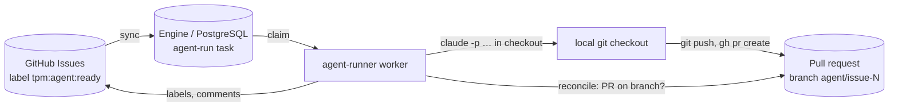
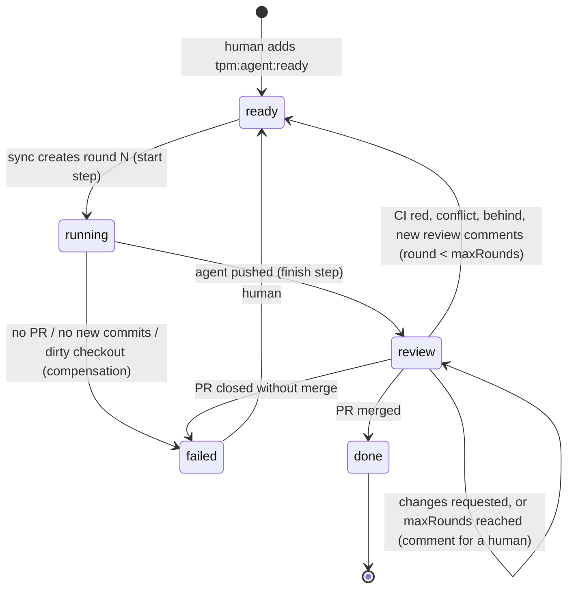

# agent-runner

Runs coding agents (Claude Code, Copilot CLI, …) on tracker items and hands the
result back as a pull request. It replaces the `orchestrate` part of the older
`tpm` tool. The task tracker itself is no longer ours: GitHub Issues is the
source of truth for _what_ to do; the engine is the source of truth for
_execution_.



## Lifecycle of one item

| Issue label         | Meaning                                                    | Set by                      |
| ------------------- | ---------------------------------------------------------- | --------------------------- |
| `tpm:agent:ready`   | Start a round (a human opts in, or the PR needs the agent) | human, or `close` step      |
| `tpm:agent:running` | A round is running                                         | `start` step                |
| `tpm:agent:review`  | The PR is ready; waiting for review / CI / merge           | `finish` step               |
| `tpm:agent:done`    | The PR was merged                                          | `close` step                |
| `tpm:agent:failed`  | The round failed or the PR was closed; comment says why    | compensation / `close` step |



Each round is one `agent-run` task. A new round is a new task, started by the
label ("continue as new"), so every task stays finite and auditable.

## The `agent-run` workflow (version 2)

```
start    tracker: ready -> running, comment            compensate: running -> failed, comment
prepare  snapshot the PR before the agent runs: head SHA + review feedback
agent    agent CLI in the checkout (one per repo); reconcile uses the same success rule
finish   tracker: running -> review, comment with PR and head SHA
review   waitForEvent('pr.outcome', correlationKey = PR URL)   — no process waits
close    tracker: merged -> done | needs agent -> ready | needs human -> comment | closed -> failed
```

- **Success is durable evidence, not an exit code.** Round 1: a PR exists on the
  deterministic branch `agent/issue-<number>`. Round 2+: the PR head SHA differs
  from the baseline stored by `prepare`. A round without new commits fails.
- **Why `prepare` is its own step**: the baseline must be taken once, before the
  agent runs. If the agent step took it, a retry after a crash would snapshot
  the agent's own push and wrongly see "no change".
- **Crash after the PR was pushed**: the lease expires, the attempt is AMBIGUOUS,
  the retry runs `reconcile` against the stored baseline, finds the new head and
  completes without starting the agent again.
- **Feedback** (failed checks, conflict/behind state, review bodies, PR comments
  except our own) is stored in the `prepare` output (max 20 000 chars) and put
  into the round-2+ prompt.
- **One agent per checkout**: `concurrencyGroup: { key: repo, limit: 1 }`.
- **Dirty checkout or wrong branch**: POLICY failure, no retry, issue `tpm:agent:failed`.
- **Provider usage limit**: TRANSIENT with `chargeAttempt: false` and the reset
  time from the output (default 30 min, max 6 h).
- **Time bound** (`timeBoundMinutes`, default 30): the worker kills the agent's
  process group; TIMEOUT, retried.
- **Every tracker write is idempotent**: label edits converge; comments carry a
  hidden `<!-- durable:<idempotency key> -->` marker that is checked first.

## PR watcher

`npm run agent-runner -- sync` also polls the PR of every run that waits in
`review` and classifies it (ported from tpm):

| PR state                                                                                      | Outcome       |
| --------------------------------------------------------------------------------------------- | ------------- |
| merged                                                                                        | `merged`      |
| closed without merge                                                                          | `abandoned`   |
| draft                                                                                         | no action     |
| review decision CHANGES_REQUESTED                                                             | `needs-human` |
| merge conflict, failed check, behind base, or a COMMENTED review newer than the newest commit | `needs-agent` |
| otherwise                                                                                     | no action     |

It sends a `pr.outcome` signal with deduplication key
`<pr url>:<outcome>:<head sha>`: polling the same state again (or from two
processes) is a duplicate and changes nothing; a new push produces a new event.
After `maxRounds` (default 3) automatic rounds, `needs-agent` only comments; a
human adds `tpm:agent:ready` to allow another round.

## Trackers and PR hosts

Each repo in the config picks where items come from (`tracker`) and where PRs
live (`host`). The handlers see one combined view per repo, so the workflow is
the same for every combination.

| `tracker`      | Items are               | `tpm:agent:*` are  | CLI         |
| -------------- | ----------------------- | ------------------ | ----------- |
| `github`       | GitHub issues           | labels             | `gh`        |
| `azure-boards` | Azure Boards work items | work item **tags** | `az boards` |

| `host`   | PRs are         | CI signal                                | CLI                        |
| -------- | --------------- | ---------------------------------------- | -------------------------- |
| `github` | GitHub PRs      | status check rollup                      | `gh`                       |
| `ado`    | Azure Repos PRs | newest Azure Pipelines run on the branch | `az repos`, `az pipelines` |

Azure DevOps details (ported from tpm's ADO adapter):

- **Ready items**: WIQL query for work items in `ado.project` (optionally
  under `ado.areaPath`) whose tags contain `tpm:agent:ready` and whose state is
  not Closed/Removed/Done/Resolved; the tag is then checked exactly.
  Use `areaPath` when one project feeds several repos.
- **Refs** look like `ado:<organization>/<project>#<work item id>`.
- **Tags** are one field (`a; b; c`): the runner reads them and writes the new
  set. A human editing tags at the same moment can lose that edit (rare).
- **Comments** go to the work item discussion. ADO strips HTML comments, so the
  idempotency marker is a small visible line `durable:<key>`. If existing
  comments cannot be read, nothing is posted and the step retries.
- **PR outcome**: completed → merged; abandoned → closed; a reviewer vote of
  -5 or -10 → changes requested (a human); merge conflicts or a failed /
  canceled newest pipeline run → the agent's next round.
- **Feedback** for the next round: active text comments of the PR threads, the
  failed pipeline and the conflict state.
- **PR creation**: the prompt tells the agent to use
  `az repos pr create … --work-items <id>`, which links the PR to the work item.

ADO setup:

```bash
az extension add --name azure-devops
az login                     # or: export AZURE_DEVOPS_EXT_PAT=<PAT with Work Items (read/write), Code (read/write), Build (read)>
```

The agent itself runs `git` and `az repos pr create`, so its permissions must
allow `Bash(az:*)` (for Claude Code: `permissions.allow` in
`~/.claude/settings.json`). See `agent-runner.config.ado.example.json`.

## Software factory: agents write, agents review, policy merges

With `"factory": true` on a repo (GitHub host), every round adds three gates
after the agent pushes, and the PR watcher decides from their evidence:

```
finish → verify → reviewA → reviewB → review (wait) → close (merge exactly the reviewed commit)
```

- **Roles are separate.** The author agent pushes to `agent/*` only. Reviewers
  run read-only (CLI tool permissions: read files and `git diff/log/show`
  only; no edit, commit, push or `gh`) in a **separate review clone** checked
  out at the agent's exact commit, with a fresh context (task + diff + repo
  rules, not the author's reasoning). The merger is not an LLM: a pure
  decision function over durable evidence, then a merge of exactly that commit.
- **Default reviewers:** Claude (`claude -p --json-schema`) and Copilot
  (`copilot -p`, verdict in `<verdict>` tags) — two vendors. Malformed or
  missing output is `needs-human`, never `approve`. Reviewer B is skipped when
  verify failed or reviewer A did not approve (no wasted cost).
- **Evidence = commit statuses on the reviewed SHA:** `tpm/verify`,
  `tpm/review-claude`, `tpm/review-copilot`, `tpm/human-approval`. A new push
  has none of them, so it can never merge on old evidence. Findings are also
  PR comments, and they are the next round's feedback.
- **Merge** uses GitHub's REST merge with `sha=<reviewed commit>`: GitHub
  refuses if the head moved. Then the branch is deleted.

### Policy: `.tpm/agent-policy.yml` in the repo (read from the default branch)

```yaml
version: 1
default: human-merge # unmatched paths
rules: # first matching rule per file; a change gets its strictest file
  - paths: ['docs/**', '*.md']
    level: auto-merge # agents write + review, the factory merges
  - paths: ['dist/**']
    level: human-approve # + an approver adds the PR label tpm:agent:approve
    verify: true # run verify.command first
reviewers:
  - { name: claude, model: claude-sonnet-5-5, maxBudgetUsd: 3 }
  - { name: copilot }
approvers: [htalat] # who may approve human-approve changes
starters: [htalat] # who may start a run (adds tpm:agent:ready)
verify:
  command: npm ci && npx playwright install chromium && npm test
  timeoutMinutes: 30
maxAutoMergesPerDay: 5
maxChangedLines: 400 # bigger changes need at least human-approve
```

Rules that cannot be configured away: a change to `.tpm/**` always needs a
human merge (an agent cannot raise its own autonomy); no policy file means a
human merges; an approval only counts if given after the newest commit and by
a listed approver; signals only escalate. On platforms with rules (rulesets,
CODEOWNERS, ADO branch policies) a `BLOCKED` merge state also waits, so the
platform stays a second guard.

| Decision         | When                                                                    | Result                           |
| ---------------- | ----------------------------------------------------------------------- | -------------------------------- |
| `ready-to-merge` | all gates pass on the reviewed commit, and auto-merge or approved       | factory merges, `tpm:agent:done` |
| `needs-agent`    | verify failed, a reviewer requested changes, CI red, conflict           | next round with the findings     |
| `needs-human`    | reviewer unsure/malfunctioned, human-merge paths, cap reached, new push | comment; a human decides         |
| `no-action`      | waiting for a gate, an approval, or platform rules                      | keep waiting                     |

Cost note: one Claude Code reviewer call with the default model and context
cost about $0.67 in our test; with a small model about $0.06. Set `model` and
`maxBudgetUsd` per reviewer.

## Setup

1. `gh auth login` (the GitHub adapter uses the `gh` CLI).
2. `cp agent-runner.config.example.json agent-runner.config.json` and list
   your repos with their local checkout paths.
3. Create the labels once: `npm run agent-runner -- labels`.
4. Run the engine (`npm run api`, `npm run orchestrator`) and:

```bash
npm run agent-runner -- sync     # polls GitHub every syncIntervalMs
npm run agent-runner -- worker   # runs agents (WORKER_CONCURRENCY, LEASE_MS)
```

`claude` must be on `PATH` and allowed to run non-interactively (or set
`CLAUDE_BIN`). For Copilot set `"agent": "copilot"` per repo (`COPILOT_BIN`,
`COPILOT_GITHUB_TOKEN`). Transcripts go to `runsDir/<ref>/<attempt-id>.log`
and are recorded as `agent-log` artifacts.

## Not done yet

- **Agent-decided no-op rounds**: a round must push a commit. If a review
  comment needs only an answer, the round fails and a human handles it.
- **Review threads**: feedback includes reviews and PR comments, not inline
  review-thread resolution state (needs the GraphQL API).
- **Other trackers**: GitHub Issues and Azure Boards. Linear/Jira are a new `Tracker`.
- **ADO adapters are tested with a fake `az`**, not yet against a real Azure DevOps organization.
- **Worktrees**: one checkout per repo, serialized. Per-run `git worktree`
  would allow parallel runs in one repo.
- **Webhooks**: the watcher polls (every `syncIntervalMs`). A GitHub webhook
  receiver could call the same signal API for lower latency.
