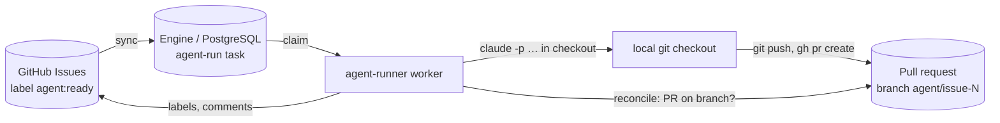
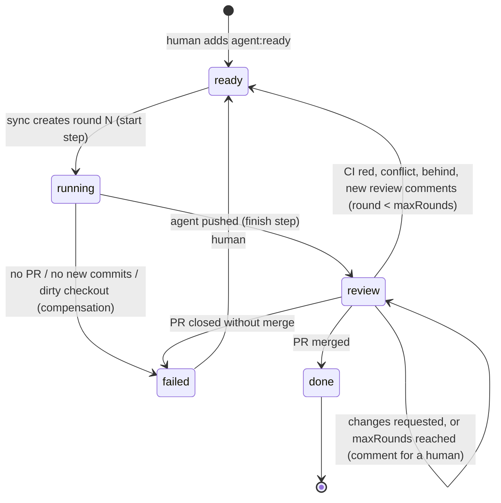

# agent-runner

Runs coding agents (Claude Code, Copilot CLI, …) on tracker items and hands the
result back as a pull request. It replaces the `orchestrate` part of the older
`tpm` tool. The task tracker itself is no longer ours: GitHub Issues is the
source of truth for _what_ to do; the engine is the source of truth for
_execution_.



## Lifecycle of one item

| Issue label     | Meaning                                                    | Set by                      |
| --------------- | ---------------------------------------------------------- | --------------------------- |
| `agent:ready`   | Start a round (a human opts in, or the PR needs the agent) | human, or `close` step      |
| `agent:running` | A round is running                                         | `start` step                |
| `agent:review`  | The PR is ready; waiting for review / CI / merge           | `finish` step               |
| `agent:done`    | The PR was merged                                          | `close` step                |
| `agent:failed`  | The round failed or the PR was closed; comment says why    | compensation / `close` step |



Each round is one `agent-run` task. A new round is a new task, started by the
label ("continue as new"), so every task stays finite and auditable.

## The `agent-run` workflow (version 2)

```
start    tracker: ready -> running, comment            compensate: running -> failed, comment
prepare  snapshot the PR before the agent runs: head SHA + review feedback
agent    agent CLI in the checkout (one per repo); reconcile uses the same success rule
finish   tracker: running -> review, comment with PR and head SHA
review   waitForEvent('pr.outcome', correlationKey = PR URL)   — no process waits
close    tracker: merged -> done | needs agent -> ready | needs human -> comment | closed -> failed
```

- **Success is durable evidence, not an exit code.** Round 1: a PR exists on the
  deterministic branch `agent/issue-<number>`. Round 2+: the PR head SHA differs
  from the baseline stored by `prepare`. A round without new commits fails.
- **Why `prepare` is its own step**: the baseline must be taken once, before the
  agent runs. If the agent step took it, a retry after a crash would snapshot
  the agent's own push and wrongly see "no change".
- **Crash after the PR was pushed**: the lease expires, the attempt is AMBIGUOUS,
  the retry runs `reconcile` against the stored baseline, finds the new head and
  completes without starting the agent again.
- **Feedback** (failed checks, conflict/behind state, review bodies, PR comments
  except our own) is stored in the `prepare` output (max 20 000 chars) and put
  into the round-2+ prompt.
- **One agent per checkout**: `concurrencyGroup: { key: repo, limit: 1 }`.
- **Dirty checkout or wrong branch**: POLICY failure, no retry, issue `agent:failed`.
- **Provider usage limit**: TRANSIENT with `chargeAttempt: false` and the reset
  time from the output (default 30 min, max 6 h).
- **Time bound** (`timeBoundMinutes`, default 30): the worker kills the agent's
  process group; TIMEOUT, retried.
- **Every tracker write is idempotent**: label edits converge; comments carry a
  hidden `<!-- durable:<idempotency key> -->` marker that is checked first.

## PR watcher

`npm run agent-runner -- sync` also polls the PR of every run that waits in
`review` and classifies it (ported from tpm):

| PR state                                                                                      | Outcome       |
| --------------------------------------------------------------------------------------------- | ------------- |
| merged                                                                                        | `merged`      |
| closed without merge                                                                          | `abandoned`   |
| draft                                                                                         | no action     |
| review decision CHANGES_REQUESTED                                                             | `needs-human` |
| merge conflict, failed check, behind base, or a COMMENTED review newer than the newest commit | `needs-agent` |
| otherwise                                                                                     | no action     |

It sends a `pr.outcome` signal with deduplication key
`<pr url>:<outcome>:<head sha>`: polling the same state again (or from two
processes) is a duplicate and changes nothing; a new push produces a new event.
After `maxRounds` (default 3) automatic rounds, `needs-agent` only comments; a
human adds `agent:ready` to allow another round.

## Setup

1. `gh auth login` (the GitHub adapter uses the `gh` CLI).
2. `cp agent-runner.config.example.json agent-runner.config.json` and list
   your repos with their local checkout paths.
3. Create the labels once: `npm run agent-runner -- labels`.
4. Run the engine (`npm run api`, `npm run orchestrator`) and:

```bash
npm run agent-runner -- sync     # polls GitHub every syncIntervalMs
npm run agent-runner -- worker   # runs agents (WORKER_CONCURRENCY, LEASE_MS)
```

`claude` must be on `PATH` and allowed to run non-interactively (or set
`CLAUDE_BIN`). For Copilot set `"agent": "copilot"` per repo (`COPILOT_BIN`,
`COPILOT_GITHUB_TOKEN`). Transcripts go to `runsDir/<ref>/<attempt-id>.log`
and are recorded as `agent-log` artifacts.

## Not done yet

- **Agent-decided no-op rounds**: a round must push a commit. If a review
  comment needs only an answer, the round fails and a human handles it.
- **Review threads**: feedback includes reviews and PR comments, not inline
  review-thread resolution state (needs the GraphQL API).
- **Other trackers**: only GitHub Issues. Linear/Jira are a new `TaskSource`.
- **Worktrees**: one checkout per repo, serialized. Per-run `git worktree`
  would allow parallel runs in one repo.
- **Webhooks**: the watcher polls (every `syncIntervalMs`). A GitHub webhook
  receiver could call the same signal API for lower latency.
