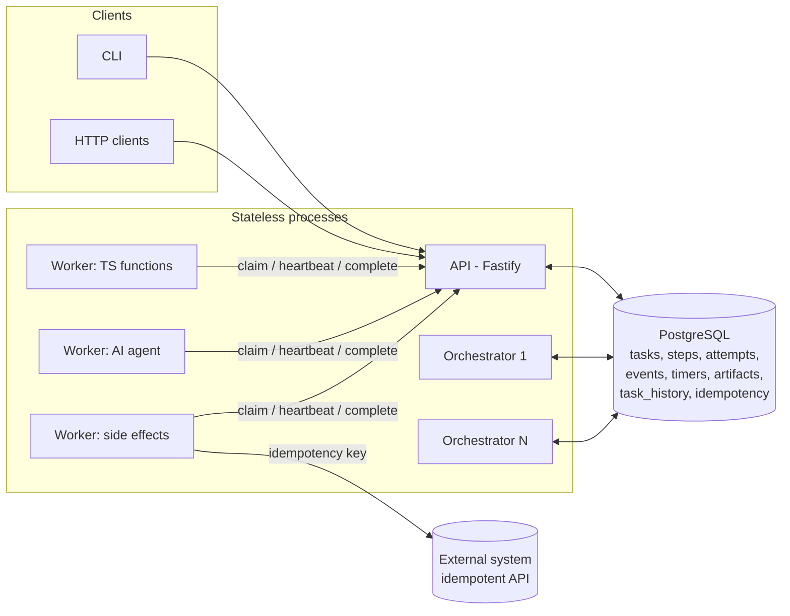
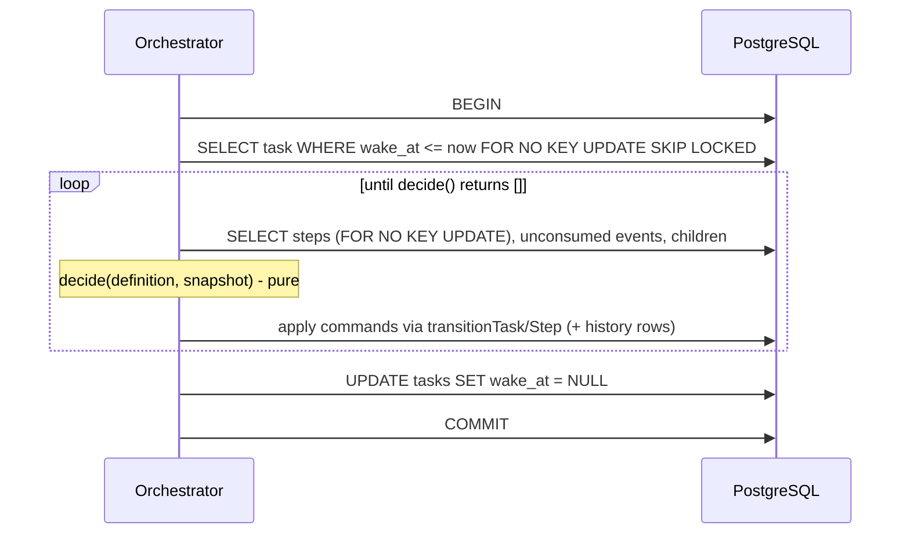

# Architecture

## Summary

The engine is a **persisted state machine** stored in PostgreSQL. Processes are
stateless. Any process can die after any statement. A new process reads
PostgreSQL and continues.

There is no workflow-code replay. A workflow definition is data (steps,
dependencies, retry policies) plus small pure functions that map stored values
to the input of the next step.



## Packages

| Path                     | Role                                                                                                                                                    | Depends on                  |
| ------------------------ | ------------------------------------------------------------------------------------------------------------------------------------------------------- | --------------------------- |
| `packages/core`          | Pure domain: state machines, retry math, workflow DSL + compiler, `decide()`, protocol schemas, ports (clock, ids, random), failure injection. No I/O.  | zod                         |
| `packages/db`            | Pool, transaction helpers, SQL migrations, migration runner.                                                                                            | pg                          |
| `packages/engine`        | Transactional operations: create/cancel/pause, claim, heartbeat, complete, fail, reaper, timer scheduler, retry promoter, orchestration cycle, signals. | core, db, observability     |
| `packages/sdk`           | Worker runtime (poll, heartbeat, timeout, reconcile, report), HTTP transport, artifact stores.                                                          | core, observability         |
| `packages/observability` | JSON logger with redaction, metrics (Prometheus text), OpenTelemetry spans.                                                                             | pino, @opentelemetry/api    |
| `packages/testkit`       | In-process transport, test DB helpers, process supervisor (real SIGKILL).                                                                               | engine, sdk                 |
| `examples`               | Example workflows, workers, the simulated external system, the agent adapters.                                                                          | core, sdk                   |
| `apps/api`               | REST API.                                                                                                                                               | engine, examples (registry) |
| `apps/orchestrator`      | Background loop: promote retries, fire timers, reap leases, run orchestration cycles.                                                                   | engine, examples (registry) |
| `apps/worker`            | Example worker process (HTTP transport).                                                                                                                | sdk, examples               |
| `apps/cli`               | CLI and the durability demo.                                                                                                                            | testkit                     |

The orchestration domain (`core`) does not know about HTTP, SQL, or any worker
implementation. `decide()` takes a snapshot and returns commands.

## The orchestration cycle



1. **LOAD**: lock one due task (`wake_at <= now`) with `SKIP LOCKED`. Many
   orchestrators run at the same time without coordination.
2. **RECONCILE / DECIDE**: `decide()` looks at durable state only: steps,
   unconsumed events, child task status.
3. **PERSIST**: commands are applied with the central transition functions. Each
   transition writes a `task_history` row in the same transaction.
4. **DISPATCH / WAIT / COMPLETE**: "dispatch" is only `step -> READY`. Workers
   pull. "Wait" is a `WAITING` step plus a timer row or an event subscription.
5. **EXIT**: commit. If the process dies before commit, PostgreSQL rolls back
   and `wake_at` is still set, so another orchestrator redoes the cycle.

Who sets `wake_at`? Every durable change that can unblock progress: task
creation, step completion/failure, lease expiry, timer firing, signals, child
task completion, resume, operator resolution.

## Background duties (orchestrator process)

| Duty                   | Query                                                      | Effect (one transaction per item)                                              |
| ---------------------- | ---------------------------------------------------------- | ------------------------------------------------------------------------------ |
| `promoteDueRetries`    | `steps.status = RETRYING AND available_at <= now`          | `RETRYING -> READY`, wake task                                                 |
| `fireDueTimers`        | `timers.status = SCHEDULED AND fire_at <= now`             | insert `__timer.fired` event (dedup by timer id), timer `FIRED`, wake task     |
| `reapExpiredLeases`    | `attempts.status = RUNNING AND (lease or deadline passed)` | attempt `EXPIRED` (TIMEOUT or AMBIGUOUS), retry/block/fail the step, wake task |
| `runOrchestrationPass` | `tasks.wake_at <= now`                                     | the cycle above                                                                |

## Transaction boundaries and lock order

All row locks follow one global order: **task → step → attempt**. Tasks and steps
are locked with `FOR NO KEY UPDATE` (not `FOR UPDATE`) so that inserts with a
foreign key to them (attempts, events, child tasks) take a compatible
`FOR KEY SHARE` lock and do not deadlock with the orchestrator. Rare deadlocks
(child → parent wake vs parent → child cancel) are detected by PostgreSQL and
the transaction is retried (`withRetryingTransaction`).

| Operation           | Transaction contents                                                                                     | Why it must be one transaction                                                |
| ------------------- | -------------------------------------------------------------------------------------------------------- | ----------------------------------------------------------------------------- |
| Create task         | idempotency record, task row, all initial step rows, history                                             | a task without its steps would be stuck                                       |
| Claim               | `SELECT … FOR UPDATE OF s SKIP LOCKED`, insert attempt (token, lease, deadline), step `READY -> RUNNING` | an attempt without a RUNNING step (or the reverse) breaks the lease invariant |
| Heartbeat           | single `UPDATE … WHERE lease_token AND status = RUNNING`                                                 | atomic compare-and-set                                                        |
| Complete            | lock task/step/attempt, check token, attempt `COMPLETED`, artifacts, step `COMPLETED`, wake task         | output, artifacts and state must appear together                              |
| Fail                | lock, attempt `FAILED`, compute and persist retry time, step `RETRYING/FAILED/BLOCKED`, wake             | retry schedule must be durable with the failure                               |
| Reap                | lock, re-check expiry, attempt `EXPIRED`, retry decision, wake                                           | the reaper and a late completion race; the lock makes one win                 |
| Fire timer          | lock task + timer, insert event, timer `FIRED`, wake                                                     | the event and the timer state must agree                                      |
| Signal              | lock task, insert event (unique dedup key), history, wake                                                | dedup + wake                                                                  |
| Orchestration cycle | everything `decide()` asks for, including timer creation, child-task creation, map expansion             | partial expansion or a half-registered timer must never be visible            |
| Cancel              | task `CANCELLED`, all non-running steps cancelled, timers cancelled, children cancelled recursively      | intent + effects atomically                                                   |

## Workflow definitions

```ts
defineWorkflow({
  name: 'company-research',
  steps: {
    loadCompanies: step({ executor: 'echo', input: (ctx) => ctx.input }),
    researchCompanies: map({ items: (ctx) => ctx.outputs.loadCompanies.companies, executor: 'agent', concurrency: 10 }),
    approval: waitForEvent('approval'),
    generateReport: step({ executor: 'aggregate', input: (ctx) => … }),
  },
  flow: sequence('loadCompanies', 'researchCompanies', 'approval', 'generateReport'),
});
```

Primitives: `step`, `map` (fan-out to worker steps or child workflows with a
concurrency limit), `waitForEvent`, `sleep`, `childTask`, and `sequence` /
`parallel` / `after` for ordering. `defineWorkflow` validates and compiles to a
dependency graph (topological order, cycle detection).

Definitions are trusted code deployed with the service, kept in a
`WorkflowRegistry`. Tasks record `type` and `workflow_version`. Never change an
existing version in place; register a new version. The API never accepts
workflow code.

Input functions run inside the orchestrator transaction that stores their
result. They must be pure and deterministic.

## Observability

- **Logs**: JSON (pino). Fields `task_id`, `step_id`, `attempt_id`,
  `worker_id`, `lease_id` (a non-reversible hash of the lease token),
  `event_type`, `correlation_id`. `input`, `output`, `payload`, tokens and
  authorization headers are redacted.
- **History**: `task_history` is the audit record, not the logs. It is
  append-only (a trigger rejects UPDATE/DELETE).
- **Metrics**: `/metrics` on the API and (optional) on the orchestrator.
  Counters are per process; `durable_tasks{status}` and
  `durable_attempts_running` are read from PostgreSQL and are global.
- **Tracing**: spans via `@opentelemetry/api` around claim, complete and
  orchestration. Without an SDK they are no-ops. To export, register
  `@opentelemetry/sdk-node` at the top of each `main.ts`.

## Time

All timestamps are `timestamptz`; sessions use `timezone=UTC`. The engine takes
"now" from an injected `Clock` (system clock in production, fake clock in
tests). Lease and timer comparisons are done with the engine's clock. Workers
use only relative durations (`leaseMs`, `timeoutMs`) from the work item, so
worker clock skew does not matter. Engine processes must have synchronized
clocks (NTP); see [failure-model.md](failure-model.md).
