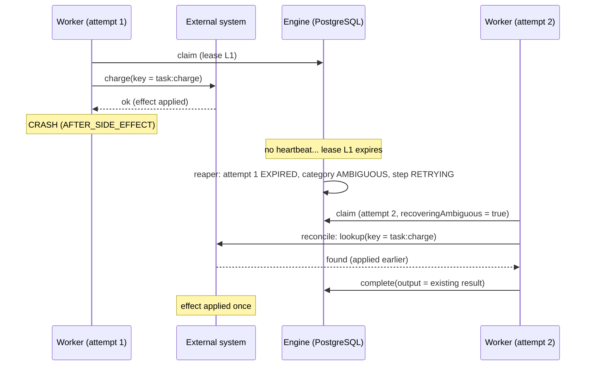

# Idempotency and the limits of "exactly once"

## The guarantee

The engine gives **at-least-once execution** of every step, and
**exactly-once state transitions** inside PostgreSQL.

It does **not** give exactly-once side effects in external systems by itself.
Nobody can, without the external system's help: between "the effect happened
over there" and "we recorded that it happened here" there is always a window in
which a crash loses the record. Two systems cannot commit atomically without a
shared protocol (2PC, or an idempotency key).

What the engine provides is everything the external system needs to cooperate:

1. a **stable idempotency key per step** (`<task_id>:<step_key>`, stored in
   `steps.idempotency_key` with a UNIQUE constraint, identical across attempts,
   restarts and orchestrators),
2. an honest outcome classification (**AMBIGUOUS**, not FAILED, when a lease
   expires on a step with side effects),
3. a **reconcile hook** that runs before re-execution when the previous outcome
   is unknown.

## The failure window



## How a worker uses it

```ts
const charge: WorkerHandler<ChargeInput, ChargeResult> = {
  async execute(input, ctx) {
    // The external API deduplicates by key: a repeat returns the first result.
    return payments.charge({ ...input, idempotencyKey: ctx.idempotencyKey });
  },
  async reconcile(input, ctx) {
    const existing = await payments.find(ctx.idempotencyKey);
    return existing ? { outcome: 'APPLIED', output: existing } : { outcome: 'NOT_APPLIED' };
  },
};
```

- `APPLIED` → the step completes with that output; `execute` is not called.
- `NOT_APPLIED` → `execute` runs normally.
- `UNKNOWN` → the attempt fails as `AMBIGUOUS`; policy decides (retry, or BLOCKED
  when retries are exhausted or the step is `effect: 'unsafe'`).

Without a `reconcile` hook the runtime re-executes, and safety depends on the
external system deduplicating by the key (tested: one effect, two calls).

The example external system (`examples/src/external-system.ts`, schema
`example_external`) is a stand-in for a real API with idempotency keys. It is
deliberately **outside** engine transactions.

## Choosing `effect` per step

| `effect`               | Lost lease means | Behaviour                                         | Use for                                                      |
| ---------------------- | ---------------- | ------------------------------------------------- | ------------------------------------------------------------ |
| `pure`                 | `TIMEOUT`        | retry blindly                                     | computation, reads, LLM calls without side effects           |
| `idempotent` (default) | `AMBIGUOUS`      | retry; worker reconciles / external system dedups | APIs that accept idempotency keys, upserts keyed by step key |
| `unsafe`               | `AMBIGUOUS`      | step BLOCKED; operator decides                    | e-mails/SMS/legacy APIs with no dedup and no lookup          |

Retries exhausted on AMBIGUOUS also BLOCK (never FAILED), because compensation
logic would otherwise assume the effect did not happen.

## Other idempotent operations

| Operation          | Mechanism                                                                                 |
| ------------------ | ----------------------------------------------------------------------------------------- |
| `POST /tasks`      | `Idempotency-Key` header → `idempotency_records` (request hash checked → 422 on mismatch) |
| complete / fail    | same attempt + same token after success → `ALREADY_ACCEPTED`                              |
| signals            | `deduplicationKey` → `UNIQUE (task_id, deduplication_key)`                                |
| timer firing       | event dedup key `timer:<timer_id>`; timer row CAS `SCHEDULED -> FIRED`                    |
| child spawn        | `UNIQUE tasks.parent_step_id`                                                             |
| timer registration | `UNIQUE (step_id, timer_type)`                                                            |
| artifacts          | stores are keyed by `<task>/<step>/<name>`; a retried attempt overwrites the same object  |
| compensation steps | ordinary steps with their own idempotency key `<task>:compensate:<step>`                  |

## What is NOT guaranteed

- Exactly-once side effects in systems that do not deduplicate and cannot be
  queried. For those, `effect: 'unsafe'` turns the ambiguity into a human
  decision instead of hiding it.
- That a worker stops immediately on cancellation or lease loss. It is told
  (heartbeat response / `AbortSignal`) and its results are rejected or recorded
  honestly, but code that ignores the signal keeps running.
- Undo of completed side effects on cancellation. Compensation runs only on
  failure, and only for steps that declare `compensate`.
