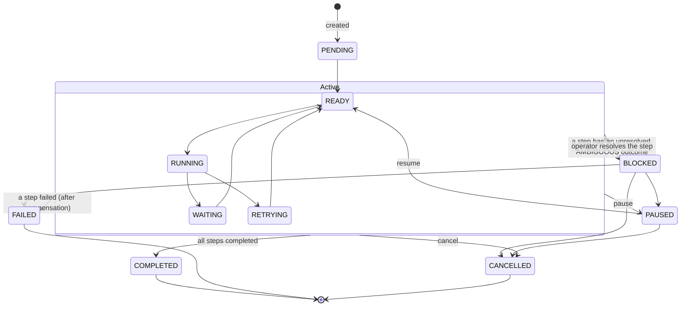
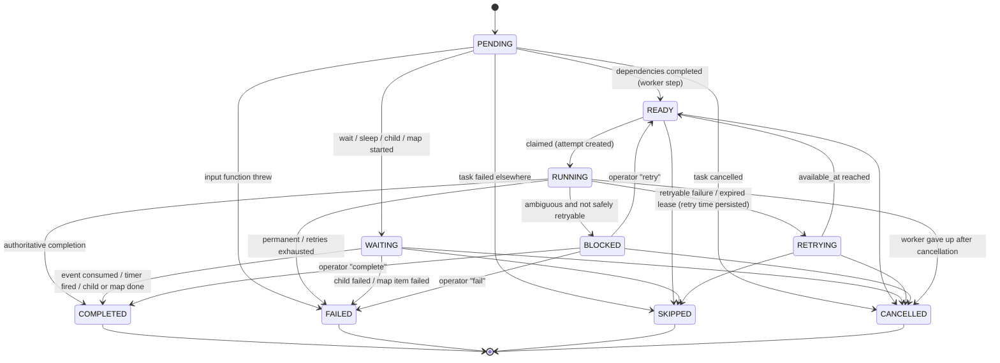
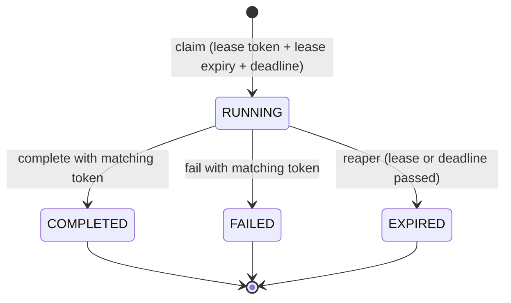
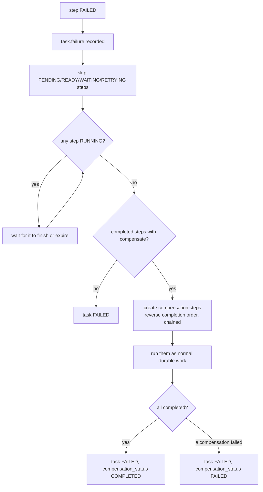

# State machines

All status changes go through three functions in
`packages/engine/src/transitions.ts`: `transitionTask`, `transitionStep`,
`transitionAttempt`. Each one:

1. checks `from -> to` against the tables in `packages/core/src/status.ts`
   (`InvalidTransitionError` if not allowed),
2. runs `UPDATE … WHERE id = $id AND status = $from AND version = $version`
   (`ConcurrencyConflictError` if no row matched),
3. inserts a `task_history` row in the same transaction.

No other code writes a `status` column.

## Task

READY, RUNNING, WAITING and RETRYING are **summary statuses** derived by the
orchestrator from the steps. Claims do not update the task row (to avoid a
lock on every claim), so the summary can lag by one cycle. The authoritative
progress is in the steps.

Derivation (first match): any step BLOCKED → BLOCKED; RUNNING → RUNNING;
READY → READY; RETRYING → RETRYING; WAITING → WAITING.

Terminal: COMPLETED, FAILED, CANCELLED. No outgoing edges.

## Step

There is **no edge out of COMPLETED** (Invariant 1).

Step types: `task` (worker), `map` (fan-out parent), `wait_event`, `sleep`,
`child`, `compensation` (worker). Map items are `task` or `child` steps with a
`parent_step_id`.

## Attempt

A retry never reuses an attempt: it creates attempt `n+1` with a new token.
A partial unique index allows at most one RUNNING attempt per step.

## Timer

`SCHEDULED -> FIRED` (scheduler) or `SCHEDULED -> CANCELLED` (step skipped or
task cancelled). One timer per sleep step (unique index).

## Event

Inserted unconsumed. `consumed_at`/`consumed_by_step_id` are set once, in the
orchestration cycle that completes the waiting step. A step consumes at most one
event (unique index on `consumed_by_step_id`).

## Failure and compensation flow

