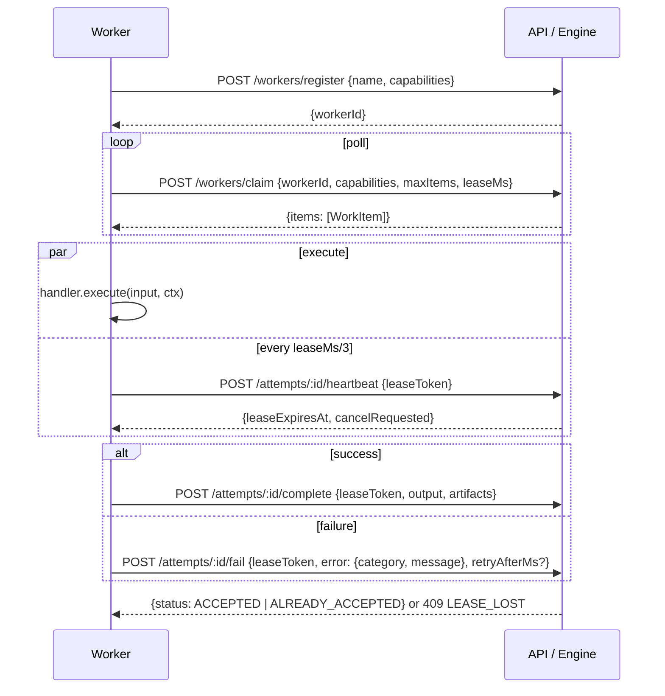

# Worker protocol

Any process that can make HTTP requests can be a worker: a TypeScript function,
an AI agent, a wrapper around a subprocess or an HTTP service. Human work uses
the signal API instead (see "Humans" below). The engine knows a worker only by
its **capabilities** (strings such as `agent`, `charge`, `compute`).

Worker identity (`workerId`, from registration) is separate from task identity.
Worker endpoints can require a separate bearer token (`WORKER_TOKEN`).

## Lifecycle



## Work item

```jsonc
{
  "taskId": "…",
  "stepId": "…",
  "stepKey": "researchCompanies[7]",
  "attemptId": "…",
  "attemptNumber": 2,
  "type": "agent", // capability
  "input": { "task": "company profile", "subject": "Initech" },
  "context": {
    "taskType": "company-research",
    "previousAttempt": {
      "attemptNumber": 1,
      "status": "EXPIRED",
      "errorType": "AMBIGUOUS",
      "errorMessage": "…",
    },
    "recoveringAmbiguous": true,
  },
  "idempotencyKey": "<taskId>:researchCompanies[7]",
  "leaseToken": "…", // secret; never log it
  "leaseExpiresAt": "2026-…Z",
  "leaseMs": 10000,
  "timeoutMs": 300000,
  "deadlineAt": "2026-…Z",
}
```

Workers must use `leaseMs` and `timeoutMs` (relative), not the absolute
timestamps, to schedule heartbeats and timeouts; their clock may differ from the
engine's.

## Completion

```json
{
  "leaseToken": "…",
  "output": { "summary": "…" },
  "artifacts": [{ "type": "report", "uri": "s3://…", "metadata": {} }]
}
```

Artifacts are references. Put large data in an artifact store (the SDK has a
`FileArtifactStore`; production would use S3/GCS) and return the URI. Output
and each payload are limited to 256 KiB; request bodies to 1 MiB.

## Failure

```json
{ "leaseToken": "…", "error": { "category": "TRANSIENT", "message": "upstream 503" }, "retryAfterMs": 5000 }
```

| Category     | Meaning                                    | Default policy                       |
| ------------ | ------------------------------------------ | ------------------------------------ |
| `TRANSIENT`  | try again later                            | retried with backoff                 |
| `TIMEOUT`    | took too long                              | retried                              |
| `DEPENDENCY` | something this step needs is not available | retried                              |
| `AMBIGUOUS`  | the effect may or may not have happened    | retried with reconcile; else BLOCKED |
| `PERMANENT`  | retrying cannot help (bad input, 4xx)      | never retried                        |
| `POLICY`     | not allowed (auth, refusal, cancelled)     | never retried                        |

The worker reports and **returns**. It never sleeps for backoff. The engine
writes `available_at = now + backoff` and the step becomes claimable again
later, on any worker.

Retry policy per step: `maxAttempts`, `initialDelayMs`, `backoffCoefficient`,
`maxDelayMs`, `jitter` (fraction), `retryOn` (categories).

## Lease rules

- A lease is authoritative while the attempt is `RUNNING` and the token
  matches. Heartbeat extends `lease_expires_at`.
- The reaper ends authority when `lease_expires_at` (or the step deadline)
  passes, by moving the attempt to `EXPIRED` under a row lock. After that,
  heartbeat/complete/fail return `409 LEASE_LOST`. Stop work and drop the
  result.
- Completion and failure are idempotent for the same attempt + token: retry
  them on network errors.
- `cancelRequested: true` in a heartbeat response means the task was
  cancelled. The SDK aborts `ctx.signal`. Report a `POLICY` failure, or
  complete if the work is already done (the result is kept).

## SDK

```ts
import { WorkerRuntime, HttpTransport, FileArtifactStore } from '@durable/sdk';

const runtime = new WorkerRuntime({
  transport: new HttpTransport('http://localhost:3000', process.env.WORKER_TOKEN),
  name: 'research-worker',
  handlers: {
    agent: createAgentHandler(new MockAgentAdapter()),
    charge: { execute: …, reconcile: … },
  },
  concurrency: 4,
  leaseMs: 10_000,
  artifacts: new FileArtifactStore('./data/artifacts'),
});
runtime.start();
```

Handler context: `signal` (AbortSignal), `idempotencyKey`, `attemptNumber`,
`item`, `logger` (already carries task/step/attempt/worker ids), `artifacts`,
`addArtifact(ref)`, `crashPoint(name)`.

Errors: throw `new WorkerError(category, message, retryAfterMs?)`. Other
exceptions are classified by `classifyError` (default `TRANSIENT`).

## Agents

An AI agent is a `Worker<AgentInput, AgentOutput>`, nothing more:

```ts
interface AgentAdapter {
  execute(input: unknown, opts: { signal: AbortSignal; idempotencyKey: string }): Promise<unknown>;
}
```

`examples/src/agent.ts` has `MockAgentAdapter` (deterministic, no network) and
`createAgentHandler(adapter)`, which also writes a report artifact.
`examples/src/anthropic-adapter.ts` shows a real provider behind the same
interface; the worker loads it only with `AGENT_ADAPTER=anthropic`. The engine
has no provider code and no AI-specific fields.

## Other worker kinds

- **HTTP service**: a handler that calls the service with
  `Idempotency-Key: ctx.idempotencyKey` and maps 5xx → TRANSIENT,
  4xx → PERMANENT, timeouts → AMBIGUOUS.
- **Subprocess**: spawn with `signal: ctx.signal` so cancellation and lease loss
  kill it.
- **Another workflow**: use `childTask()` / `map({ workflow })` in the
  definition instead of a worker.
- **Humans**: use `waitForEvent('approval')` in the workflow and
  `POST /tasks/:id/signals` from the UI or the CLI. The wait is durable; no
  process needs to stay alive.
